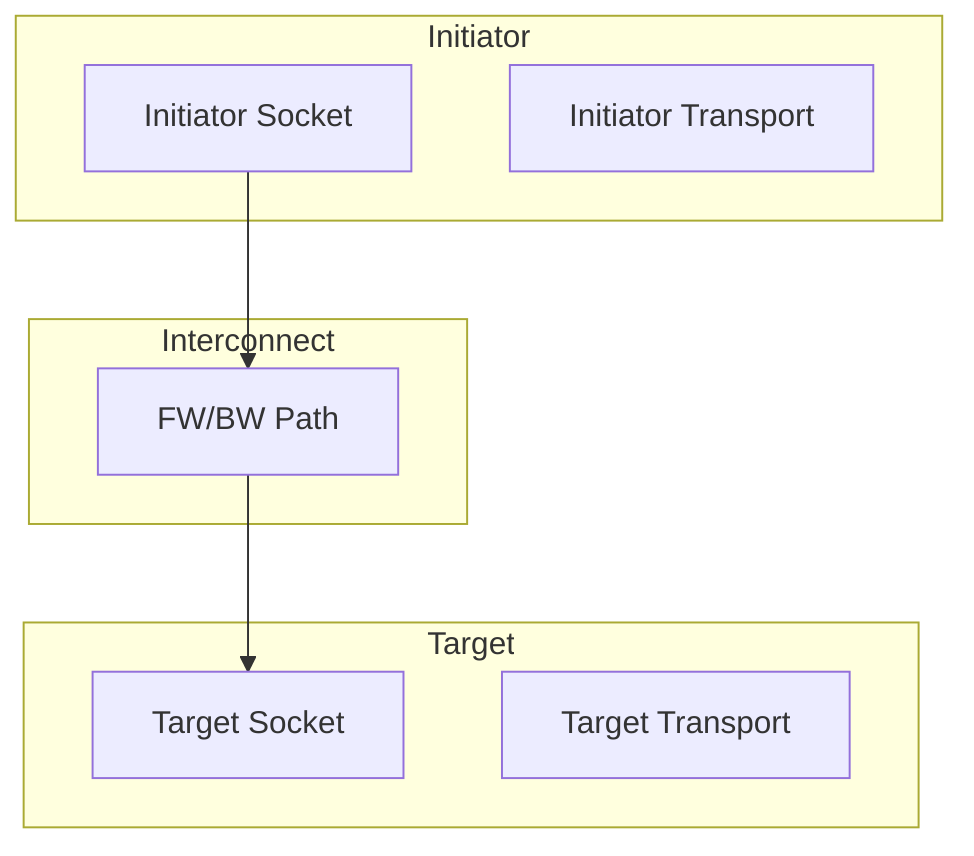

# 📚 TLM 2.0 简介

## 标准概述

TLM 2.0 是.transaction-level modeling 的行业标准，定义了：

| 组件 | 描述 |
|------|------|
| **Generic Payload** | 标准事务类型 |
| **Sockets** | 端口连接机制 |
| **Transport Interfaces** | 传输接口 |
| **DMI** | 直接内存接口 |
| **Quantum Keeper** | 时间管理 |

## 架构图



## TLM 2.0 优势

| 优势 | 说明 |
|------|------|
| **标准化** | 统一的事务接口 |
| **可重用** | 组件可跨项目复用 |
| **互操作** | 不同工具间互操作 |
| **性能** | DMI 加速仿真 |
| **SystemC 兼容** | 完整的跨语言支持 |

## 基本概念

### 1. Generic Payload

```systemverilog
// TLM 2.0 标准事务
uvm_tlm_gp::uvm_tlm_command_e command;
longint unsigned address;
byte data[];
int length;
uvm_tlm_byte_enable_e byte_enable;
```

### 2. Sockets

```mermaid
classDiagram
    class uvm_tlm_nb_transport_fw#(T,PHASE) {
        <<interface>>
        +nb_transport_fw()
    }
    
    class uvm_tlm_nb_transport_bw#(T,PHASE) {
        <<interface>>
        +nb_transport_bw()
    }
    
    class uvm_tlm_b_transport_fw#(T) {
        <<interface>>
        +b_transport()
    }
    
    class uvm_tlm_b_transport_bw#(T) {
        <<interface>>
        +b_transport()
    }
    
    uvm_tlm_socket <|-- uvm_tlmInitiatorSocket
    uvm_tlm_socket <|-- uvm_tlmTargetSocket
```

## 传输模式

| 模式 | 接口 | 用途 |
|------|------|------|
| **Blocking** | `b_transport()` | 简单同步传输 |
| **Non-blocking FW** | `nb_transport_fw()` | 前向非阻塞 |
| **Non-blocking BW** | `nb_transport_bw()` | 反向非阻塞 |

## 示例：基本连接

```systemverilog
// Initiator
class initiator extends uvm_component;
    uvm_tlm_nb_transport_bw#(gp)::type_id::create("initiator", this);
    
    task run_phase(uvm_phase phase);
        gp trans = new();
        trans.set_address('h1000);
        trans.set_data('hDEADBEEF);
        trans.set_command(UVM_TLM_WRITE_COMMAND);
        
        // Blocking 传输
        initiator_socket.b_transport(trans, 0);
    endtask
endclass

// Target
class target extends uvm_component;
    uvm_tlm_nb_transport_fw#(gp)::export_type_id::create("target", this);
    
    function void b_transport(gp trans, uvm_tlm_time delay);
        // 处理事务
        `uvm_info("TARGET", 
            $sformatf("Got: addr=0x%0h data=0x%0h", 
                trans.get_address(), trans.get_data()), UVM_LOW)
    endfunction
endclass
```

## 最佳实践

| 实践 | 说明 |
|------|------|
| 使用 Generic Payload | 保持事务标准化 |
| 选择合适传输模式 | 简单用 blocking |
| 利用 DMI | 加速内存访问 |
| 时间管理 | 使用 quantum keeper |

## 进阶阅读

- [Generic Payload](02-generic-payload/)
- [Sockets & Interfaces](03-sockets-interfaces/)
- [DMI](04-dmi/)
