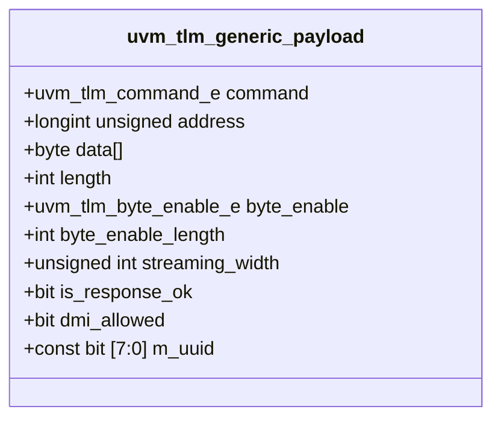

# 📦 Generic Payload

## 概述

Generic Payload 是 TLM 2.0 定义的标准事务类型，包含所有必要的事务信息。



## 核心属性

| 属性 | 类型 | 说明 |
|------|------|------|
| `command` | uvm_tlm_command_e | READ/WRITE/UNKNOWN |
| `address` | longint unsigned | 目标地址 |
| `data` | byte[] | 传输数据 |
| `length` | int | 数据长度 |
| `byte_enable` | byte_enable_e | 字节使能 |
| `streaming_width` | unsigned | 流宽度 |

## 命令类型

```systemverilog
typedef enum {
    UVM_TLM_READ_COMMAND,
    UVM_TLM_WRITE_COMMAND,
    UVM_TLM_IGNORE_COMMAND
} uvm_tlm_command_e;
```

## 字节使能

```systemverilog
typedef enum {
    UVM_TLM_BYTE_ENABLE,
    UVM_TLM_BYTE_DISABLE
} uvm_tlm_byte_enable_e;
```

## 完整示例

```systemverilog
// ==========================================
// Generic Payload 示例
// ==========================================
class gp_example extends uvm_test;
    `uvm_component_utils(gp_example)
    
    task run_phase(uvm_phase phase);
        uvm_tlm_generic_payload gp;
        uvm_tlm_time delay = new("delay", 1.0, UVM_PS);
        
        // 创建事务
        gp = new("gp");
        
        // 设置写事务
        gp.set_command(UVM_TLM_WRITE_COMMAND);
        gp.set_address('h1000_0000);
        gp.set_data_size(64);  // 64 bytes
        
        // 设置数据
        byte data[];
        data = new[64];
        for (int i = 0; i < 64; i++)
            data[i] = i;
        gp.set_data(data);
        
        // 设置字节使能
        gp.set_byte_enable_length(8);
        gp.set_byte_enable(UVM_TLM_BYTE_ENABLE);
        
        `uvm_info("GP", 
            $sformatf("Created GP: addr=0x%0h len=%0d", 
                gp.get_address(), gp.get_data_size()), UVM_LOW)
        
        // 检查事务
        if (gp.is_response_ok()) begin
            `uvm_info("GP", "Response OK", UVM_LOW)
        end
    endtask
endclass
```

## 响应状态

```systemverilog
typedef enum {
    UVM_TLM_INCOMPLETE,
    UVM_TLM_OK_RESPONSE,
    UVM_TLM_GENERIC_ERROR_RESPONSE,
    UVM_TLM_ADDRESS_ERROR_RESPONSE,
    UVM_TLM_COMMAND_ERROR_RESPONSE,
    UVM_TLM_BURST_ERROR_RESPONSE,
    UVM_TLM_BYTE_ENABLE_ERROR_RESPONSE
} uvm_tlm_response_status_e;
```

## 扩展 Generic Payload

```systemverilog
class my_gp extends uvm_tlm_generic_payload;
    `uvm_object_utils(my_gp)
    
    // 扩展属性
    int transaction_id;
    bit [7:0] tag;
    
    function new(string name="my_gp");
        super.new(name);
    endfunction
    
    // 扩展方法
    function void set_transaction_id(int id);
        transaction_id = id;
    endfunction
    
    function int get_transaction_id();
        return transaction_id;
    endfunction
endclass
```

## 使用建议

| 建议 | 说明 |
|------|------|
| 使用标准 GP | 保持互操作性 |
| 设置 m_uuid | 事务追踪 |
| 检查响应状态 | 错误处理 |
| 清理事务池 | 内存管理 |

## 进阶阅读

- [Sockets & Interfaces](03-sockets-interfaces/)
- [DMI](04-dmi/)
