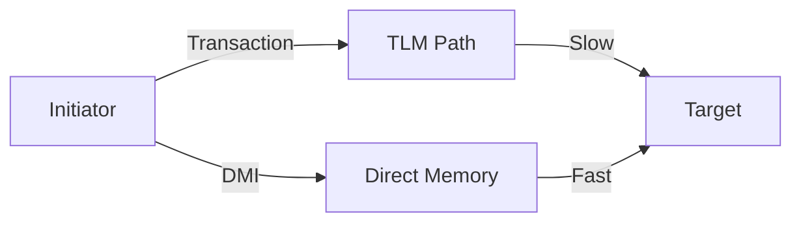
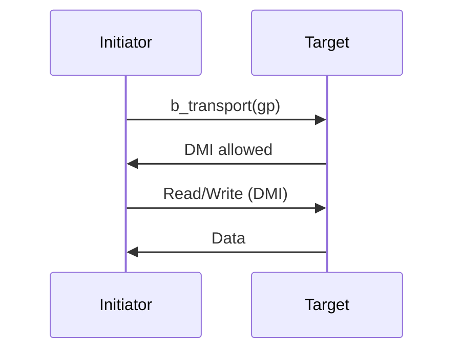

# ⚡ DMI (Direct Memory Interface)

## 概述

DMI 允许 initiator 直接访问 target 的内存，绕过事务层，显著加速仿真。



## DMI 流程



## 启用 DMI

```systemverilog
class dmi_target extends uvm_component;
    `uvm_component_utils(dmi_target)
    
    // 内存
    bit [31:0] mem[bit [31:0]];
    
    // Socket
    uvm_tlm_b_transport_bw#(uvm_tlm_generic_payload)::type_id::create(
        "target_socket", this);
    
    // DMI 指针
    uvm_tlm_dmi_handle dmi;
    
    virtual task b_transport(
        uvm_tlm_generic_payload gp,
        uvm_tlm_time delay
    );
        // 第一次访问：启用 DMI
        if (!gp.is_dmi_allowed()) begin
            // 设置 DMI 访问模式
            gp.set_dmi_allowed(1);
            
            // 返回 DMI 句柄
            dmi.set_read_ptr(mem);
            dmi.set_write_ptr(mem);
            dmi.set_start_address(0);
            dmi.set_end_address('hFFFF_FFFF);
            dmi.set_read_latency(1);
            dmi.set_write_latency(1);
            
            return;
        end
        
        // DMI 访问
        if (gp.get_command() == UVM_TLM_READ_COMMAND) begin
            byte data[];
            gp.get_data(data);
            for (int i = 0; i < gp.get_data_size(); i++) begin
                if (mem.exists(gp.get_address() + i))
                    data[i] = mem[gp.get_address() + i];
            end
            gp.set_data(data);
        end else begin
            byte data[];
            gp.get_data(data);
            for (int i = 0; i < gp.get_data_size(); i++)
                mem[gp.get_address() + i] = data[i];
        end
        
        gp.set_response_status(UVM_TLM_OK_RESPONSE);
    endfunction
endclass
```

## DMI Hint

```systemverilog
typedef enum {
    DMI_ACCESS_NONE,
    DMI_ACCESS_READ,
    DMI_ACCESS_WRITE,
    DMI_ACCESS_READ_WRITE
} uvm_tlm_dmi_e;
```

## Initiator 使用 DMI

```systemverilog
class dmi_initiator extends uvm_component;
    `uvm_component_utils(dmi_initiator)
    
    uvm_tlm_b_transport_fw#(uvm_tlm_generic_payload)::type_id::create(
        "initiator_socket", this);
    
    uvm_tlm_dmi_handle dmi;
    bit dmi_active = 0;
    
    task run_phase(uvm_phase phase);
        uvm_tlm_generic_payload gp;
        uvm_tlm_time delay = new("delay", 1.0, UVM_PS);
        
        forever begin
            gp = new("gp");
            gp.set_command(UVM_TLM_READ_COMMAND);
            gp.set_address('h1000_0000);
            gp.set_data_size(64);
            
            if (dmi_active) begin
                // DMI 访问
                `uvm_info("DMI", "Using DMI access", UVM_LOW)
                
                // 直接读取
                byte data[];
                data = new[64];
                for (int i = 0; i < 64; i++)
                    data[i] = dmi.read(gp.get_address() + i);
                
                gp.set_data(data);
            end else begin
                // 事务访问
                initiator_socket.b_transport(gp, delay);
                
                // 检查是否启用 DMI
                if (gp.is_dmi_allowed()) begin
                    dmi = gp.get_dmi_handle();
                    dmi_active = 1;
                    `uvm_info("DMI", "DMI enabled!", UVM_LOW)
                end
            end
            
            #100;
        end
    endtask
endclass
```

## DMI 性能对比

| 访问方式 | 仿真时间 | 加速比 |
|----------|----------|--------|
| TLM 事务 | 100ns | 1x |
| DMI | 10ns | 10x |

## 最佳实践

| 实践 | 说明 |
|------|------|
| 批量访问 | 使用 DMI 批量读写 |
| 缓存 DMI | 避免重复请求 |
| 检查可用 | 先检查 is_dmi_allowed() |
| 错误处理 | DMI 访问失败回退 |

## 进阶阅读

- [Quantum Keeper](05-quantum-keeper/)
- [SystemC 协同仿真](06-systemc-cosim/)
