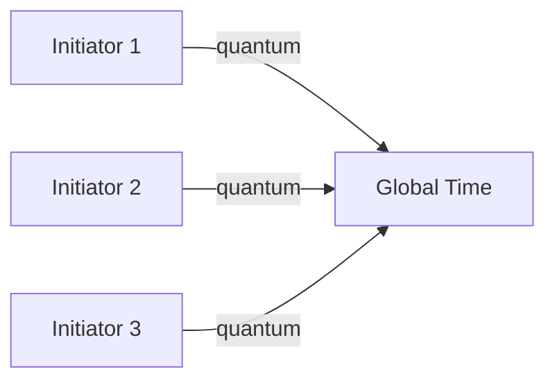
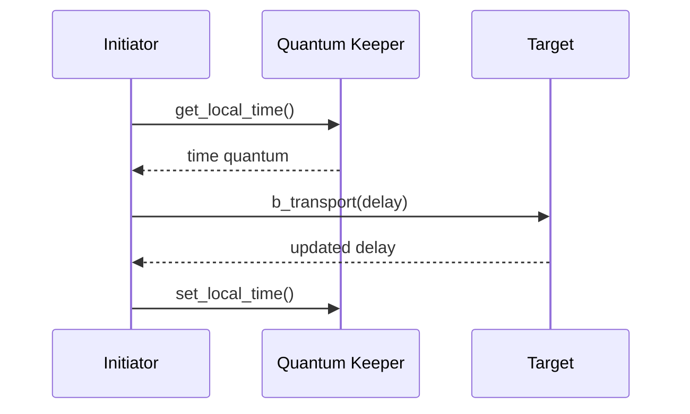

# ⏱️ Quantum Keeper

## 概述

Quantum Keeper 管理 TLM 2.0 仿真中的时间推进，确保多主设备间的时序正确性。



## 时间推进机制



## 基本使用

```systemverilog
class quantum_example extends uvm_component;
    `uvm_component_utils(quantum_example)
    
    uvm_tlm_time quantum;
    
    function new(string name, uvm_component parent);
        super.new(name, parent);
        // 创建 quantum keeper
        quantum = new("quantum", 1.0, UVM_NS);
    endtask
    
    task run_phase(uvm_phase phase);
        uvm_tlm_generic_payload gp;
        
        // 获取本地时间
        time current_time = quantum.get_current_time();
        `uvm_info("QUANTUM", 
            $sformatf("Current time: %0t", current_time), UVM_LOW)
        
        // 使用时间
        for (int i = 0; i < 10; i++) begin
            gp = new("gp");
            quantum.set(10, UVM_NS);  // 设置延迟
            
            // 推进时间
            quantum.increment(10, UVM_NS);
            
            `uvm_info("QUANTUM", 
                $sformatf("After increment: %0t", 
                    quantum.get_current_time()), UVM_LOW)
        end
    endtask
endclass
```

## 多主设备同步

```systemverilog
class sync_initiator extends uvm_component;
    `uvm_component_utils(sync_initiator)
    
    int id;
    uvm_tlm_time quantum;
    
    task run_phase(uvm_phase phase);
        uvm_tlm_generic_payload gp;
        
        forever begin
            // 获取时间
            time t = quantum.get_current_time();
            
            // 执行事务
            gp = new("gp");
            gp.set_address('h1000_0000 + id * 'h1000);
            initiator_socket.b_transport(gp, quantum);
            
            // 推进时间
            quantum.increment(100, UVM_NS);
            
            #10;
        end
    endtask
endclass

// 环境
class quantum_env extends uvm_env;
    `uvm_component_utils(quantum_env)
    
    sync_initiator init1, init2, init3;
    uvm_tlm_time global_quantum;
    
    virtual function void build_phase(uvm_phase phase);
        global_quantum = new("global_quantum", 1.0, UVM_NS);
        
        init1 = new("init1", this, 1);
        init2 = new("init2", this, 2);
        init3 = new("init3", this, 3);
    endfunction
endclass
```

## 时间单位

```systemverilog
typedef enum {
    UVM_TLM_TIME_PS,
    UVM_TLM_TIME_NS,
    UVM_TLM_TIME_US,
    UVM_TLM_TIME_MS,
    UVM_TLM_TIME_S
} uvm_tlm_time_unit;
```

## 同步策略

| 策略 | 说明 | 适用场景 |
|------|------|----------|
| **时间量子** | 固定时间步长 | 粗粒度同步 |
| **事件驱动** | 事件触发同步 | 细粒度同步 |
| **延迟累积** | 累积延迟后同步 | 混合策略 |

## 完整示例

```systemverilog
class advanced_quantum_test extends uvm_test;
    `uvm_component_utils(advanced_quantum_test)
    
    tlm2_initiator initiator;
    dmi_target target;
    uvm_tlm_time quantum;
    
    virtual function void build_phase(uvm_phase phase);
        initiator = tlm2_initiator::type_id::create("initiator", this);
        target = dmi_target::type_id::create("target", this);
        
        // 绑定
        initiator.initiator_socket.connect(target.target_socket);
        
        // 创建 quantum
        quantum = new("quantum", 10.0, UVM_NS);
    endtask
    
    virtual task run_phase(uvm_phase phase);
        uvm_tlm_generic_payload gp;
        int count = 0;
        
        phase.raise_objection(this);
        
        repeat(100) begin
            gp = new("gp");
            gp.set_command(UVM_TLM_WRITE_COMMAND);
            gp.set_address('h1000_0000 + count * 64);
            gp.set_data_size(64);
            
            byte data[];
            data = new[64];
            for (int i = 0; i < 64; i++)
                data[i] = $urandom();
            gp.set_data(data);
            
            // 传输
            initiator.initiator_socket.b_transport(gp, quantum);
            
            // 时间推进
            quantum.increment(50, UVM_NS);
            
            count++;
            #10;
        end
        
        `uvm_info("QUANTUM", 
            $sformatf("Final time: %0t", 
                quantum.get_current_time()), UVM_LOW)
        
        phase.drop_objection(this);
    endtask
endclass
```

## 最佳实践

| 实践 | 说明 |
|------|------|
| 共享 quantum | 多主设备使用同一 keeper |
| 时间分辨率 | 设置合适的粒度 |
| 避免过度同步 | 减少不必要同步 |
| 单位一致 | 保持时间单位一致 |

## 进阶阅读

- [SystemC 协同仿真](06-systemc-cosim/)
- [完整示例](../examples/)
