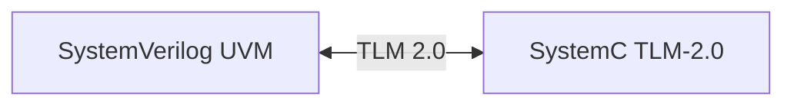
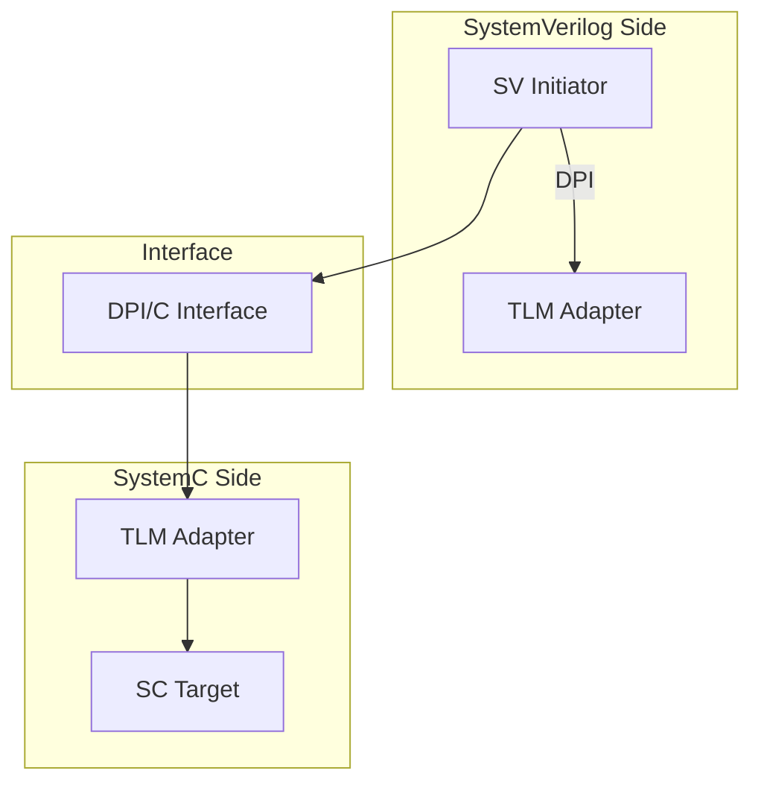

# 🔄 SystemC 协同仿真

## 概述

TLM 2.0 支持 SystemVerilog 和 SystemC 之间的无缝协同仿真。



## 协同仿真架构



## DPI 接口定义

```c
// tlm_dpi.h
#include <tlm.h>

#ifdef __cplusplus
extern "C" {
#endif

// 传输函数
int sv_tlm_b_transport(
    void* trans,
    unsigned long long delay
);

// 非阻塞传输
int sv_tlm_nb_transport_fw(
    void* trans,
    int phase,
    unsigned long long delay
);

// DMI 查询
int sv_tlm_get_dmi(
    void* trans,
    void* dmi_data
);

#ifdef __cplusplus
}
#endif
```

## SystemC Target 实现

```c++
#include <systemc.h>
#include <tlm.h>

// SystemC Target 模块
class sc_target : public sc_module, public tlm::tlm_b_transport_if<tlm::tlm_generic_payload> {
public:
    SC_HAS_PROCESS(sc_target);
    
    sc_target(sc_module_name name) : sc_module(name) {
        // 绑定接口
        initiator_socket(*this);
    }
    
    // TLM 2.0 接口
    void b_transport(tlm::tlm_generic_payload& trans, tlm::tlm_dmi& dmi) {
        // 处理事务
        sc_time delay = SC_ZERO_TIME;
        
        if (trans.get_command() == tlm::TLM_WRITE_COMMAND) {
            // 写操作
            unsigned char* data = trans.get_data_ptr();
            unsigned int len = trans.get_data_length();
            sc_dt::uint64 addr = trans.get_address();
            
            for (unsigned int i = 0; i < len; i++) {
                mem[addr + i] = data[i];
            }
        } else {
            // 读操作
            unsigned char* data = trans.get_data_ptr();
            sc_dt::uint64 addr = trans.get_address();
            
            for (unsigned int i = 0; i < trans.get_data_length(); i++) {
                data[i] = mem[addr + i];
            }
        }
        
        trans.set_response_status(tlm::TLM_OK_RESPONSE);
    }
    
    tlm::tlm_initiator_socket<32> initiator_socket;
    
private:
    unsigned char mem[1024];
};
```

## SystemVerilog 包装器

```systemverilog
// SystemC 接口包装器
class sc_target_wrapper extends uvm_component;
    `uvm_component_utils(sc_target_wrapper)
    
    // DPI 导入函数
    import "DPI-C" function int sv_tlm_init(
        input string inst_name,
        input int base_addr
    );
    
    import "DPI-C" function int sv_tlm_b_transport(
        input int trans_ptr,
        input longint delay
    );
    
    import "DPI-C" function int sv_tlm_read(
        input longint addr,
        output int data
    );
    
    import "DPI-C" function int sv_tlm_write(
        input longint addr,
        input int data
    );
    
    function new(string name, uvm_component parent);
        super.new(name, parent);
        // 初始化 SystemC 目标
        sv_tlm_init(name, 'h1000_0000);
    endtask
    
    task run_phase(uvm_phase phase);
        // 同步 SystemC
        #10;
    endtask
endclass
```

## 协同仿真示例

```systemverilog
// ==========================================
// SystemC 协同仿真环境
// ==========================================
class sc_cosim_env extends uvm_env;
    `uvm_component_utils(sc_cosim_env)
    
    // SystemVerilog 组件
    sv_initiator sv_init;
    sc_target_wrapper sc_wrapper;
    
    virtual function void build_phase(uvm_phase phase);
        sv_init = sv_initiator::type_id::create("sv_init", this);
        sc_wrapper = sc_target_wrapper::type_id::create("sc_wrapper", this);
    endfunction
    
    virtual task run_phase(uvm_phase phase);
        uvm_tlm_generic_payload gp;
        uvm_tlm_time delay = new("delay", 1.0, UVM_NS);
        
        phase.raise_objection(this);
        
        // 通过 SystemC 目标执行事务
        repeat(100) begin
            gp = new("gp");
            gp.set_command(UVM_TLM_WRITE_COMMAND);
            gp.set_address('h1000_0000 + $urandom_range(0, 255));
            gp.set_data_size(4);
            gp.set_data({$urandom(), $urandom(), $urandom(), $urandom()});
            
            // 传输到 SystemC
            sv_tlm_b_transport(gp.get_handle(), delay.get_realtime());
            
            #10;
        end
        
        phase.drop_objection(this);
    endtask
endclass
```

## DPI 性能优化

```systemverilog
// 批量传输优化
class batch_transfer;
    int addr;
    int data[];
    bit is_read;
endclass

import "DPI-C" function void sv_tlm_batch_transfer(
    input batch_transfer batch[]
);
```

## 同步机制

```c++
#include <pthread.h>

// 双向同步
void sync_sv_sc() {
    // 等待 SystemC
    wait(sc_zero_time);
    
    // 通知 SystemVerilog
    dpi_sync_done();
}
```

## 最佳实践

| 实践 | 说明 |
|------|------|
| 批量传输 | 减少 DPI 调用开销 |
| 异步处理 | 使用事件同步 |
| 内存管理 | 避免内存泄漏 |
| 错误传播 | 正确处理异常 |

## 常见问题

| 问题 | 解决方案 |
|------|----------|
| 性能差 | 使用批量传输 |
| 死锁 | 避免双向阻塞 |
| 类型不匹配 | 使用 adapter |

## 进阶阅读

- [完整示例](../examples/)
- [TLM 2.0 标准](https://www.accellera.org/)
