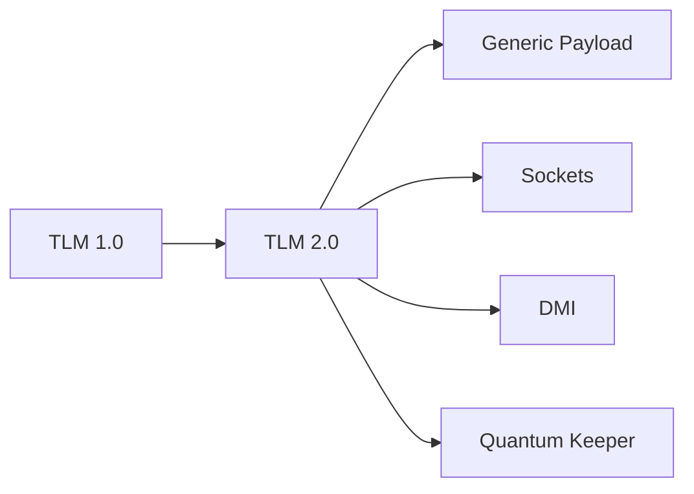
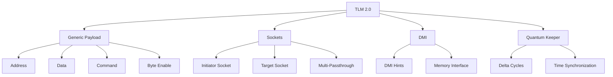

# 🚀 TLM 2.0 标准

## 概述

TLM 2.0 是 OSCI/Accellera 发布的.transaction-level modeling 标准，提供标准化的事务建模接口。

## TLM 1.0 vs TLM 2.0

| 特性 | TLM 1.0 | TLM 2.0 |
|------|----------|----------|
| 事务类型 | 自定义 | Generic Payload |
| 端口类型 | analysis_port | tlm_generic_payload |
| 传输接口 | put/get/transport | blocking/non-blocking transport |
| 延迟建模 | 无 | quantum keeper |
| 内存接口 | 无 | DMI |
| SystemC 兼容 | 有限 | 完全兼容 |

## 目录

1. [TLM 2.0 简介](01-introduction/) - 标准概述和优势
2. [Generic Payload](02-generic-payload/) - 标准事务类型
3. [Sockets & Interfaces](03-sockets-interfaces/) - 端口和接口
4. [DMI](04-dmi/) - 直接内存访问
5. [Quantum Keeper](05-quantum-keeper/) - 时间同步
6. [SystemC 协同仿真](06-systemc-cosim/) - 跨语言仿真
7. [示例代码](examples/) - 完整示例

## 核心组件

## 在线资源

- [TLM 2.0 标准](https://www.accellera.org/)
- [SystemC TLM-2.0](https://www.accellera.org/standards/systemc)
