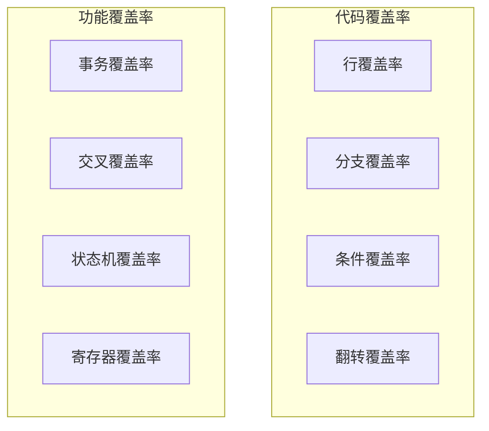

# 📚 覆盖率基础

## 覆盖率类型详解



## 代码覆盖率

| 类型 | 说明 | 目标 |
|------|------|------|
| 行覆盖率 | 代码执行了多少行 | > 95% |
| 分支覆盖率 | if/case 分支覆盖 | > 95% |
| 条件覆盖率 | 布尔表达式覆盖 | > 80% |
| 翻转覆盖率 | 信号翻转覆盖 | > 90% |

## 功能覆盖率

### 1. 事务覆盖率

```systemverilog
class trans_coverage extends uvm_subscriber#(bus_trans);
    covergroup cg;
        // 地址覆盖
        ADDR: coverpoint tr.addr {
            bins LOW = {[0:'h0FFF]};
            bins MID = {['h1000:'h7FFF]};
            bins HIGH = {['h8000:$]};
        }
        
        // 数据覆盖
        DATA: coverpoint tr.data {
            bins ZERO = {0};
            bins MAX = {'hFFFFFFFF};
            bins RAND = default;
        }
        
        // 读写覆盖
        RW: coverpoint tr.is_read {
            bins READ = {1};
            bins WRITE = {0};
        }
    endgroup
    
    virtual function void write(T t);
        void'(cg.sample());
    endfunction
    
    virtual function real get_coverage();
        return cg.get_inst_coverage();
    endfunction
endclass
```

### 2. 覆盖率收集器

```systemverilog
class env_coverage extends uvm_env;
    `uvm_component_utils(env_coverage)
    
    trans_coverage trans_cov;
    bus_agent agent;
    
    virtual function void build_phase(uvm_phase phase);
        super.build_phase(phase);
        
        trans_cov = trans_coverage::type_id::create("trans_cov", this);
        agent = bus_agent::type_id::create("agent", this);
    endfunction
    
    virtual function void connect_phase(uvm_phase phase);
        agent.monitor.ap.connect(trans_cov.analysis_export);
    endfunction
    
    virtual function void report_phase(uvm_phase phase);
        real cov = trans_cov.get_coverage();
        `uvm_info("COV_REPORT", 
            $sformatf("Transaction Coverage: %0.1f%%", cov), UVM_LOW)
        
        if (cov < 80.0) begin
            `uvm_warning("LOW_COV", "Coverage below 80%!")
        end
    endfunction
endclass
```

## 覆盖率选项

```systemverilog
covergroup cg;
    // 选项：覆盖率权重
    option.per_instance = 1;
    
    // 选项：自动bins数量
    ADDR: coverpoint tr.addr {
        bins ADDR_BINS[] = {[0:$]};
    }
    
    // 忽略特定值
    DATA: coverpoint tr.data {
        ignore_bins IGNORE = {0, 'hFFFFFFFF};
    }
    
    // 非法值
    SIZE: coverpoint tr.size {
        illegal_bins ILLEGAL = {3, 4, 5, 6, 7};
    }
endgroup
```

## 最佳实践

| 实践 | 说明 |
|------|------|
| 使用有意义的 bins | `KB_0_4` > `bin1` |
| 合理设置忽略值 | 减少不必要覆盖 |
| 分层覆盖率 | 事务→场景→系统 |
| 自动报告 | 仿真结束时输出 |

## 常见问题

| 问题 | 解决方案 |
|------|----------|
| 覆盖率不涨 | 检查 transaction 是否到达 |
| Bins 过多 | 使用范围 bins |
| 覆盖率停滞 | 添加随机约束或新测试 |

## 进阶阅读

- [交叉覆盖率](02-cross-coverage/)
- [寄存器覆盖率](03-reg-coverage/)
