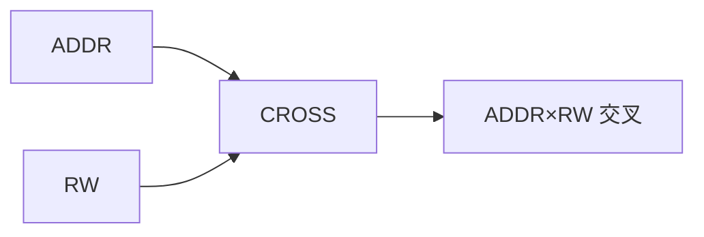

# 🚀 交叉覆盖率

## 交叉覆盖概述

交叉覆盖用于捕获多个变量之间的关系。



## 基本交叉

```systemverilog
class cross_coverage extends uvm_subscriber#(bus_trans);
    covergroup cg;
        // 独立覆盖点
        ADDR: coverpoint tr.addr {
            bins KB[] = {[0:'h1000]};
            bins MB[] = {['h1001:$]};
        }
        
        RW: coverpoint tr.is_read {
            bins READ = {1};
            bins WRITE = {0};
        }
        
        // 交叉覆盖
        ADDR_RW: cross ADDR, RW;
    endgroup
    
    virtual function void write(T t);
        void'(cg.sample());
    endfunction
endclass
```

## 带权重的交叉

```systemverilog
class weighted_cross extends uvm_subscriber#(bus_trans);
    covergroup cg;
        ADDR: coverpoint tr.addr {
            bins LOW = {[0:'h0FFF]};
            bins HIGH = {['h1000:$]};
        }
        
        LEN: coverpoint tr.length {
            bins SHORT = {[1:4]};
            bins MEDIUM = {[5:16]};
            bins LONG = {[17:$]};
        }
        
        // 交叉覆盖，带权重
        ADDR_LEN: cross ADDR, LEN {
            // 某些组合权重更高
            bins ADDR_LOW_LEN_MEDIUM = 
                binsof(ADDR.LOW) && binsof(LEN.MEDIUM);
        }
    endgroup
    
    virtual function void write(T t);
        void'(cg.sample());
    endfunction
endclass
```

## 三变量交叉

```systemverilog
class three_way_cross extends uvm_subscriber#(bus_trans);
    covergroup cg;
        // 三个变量
        ADDR: coverpoint tr.addr {
            bins KB0 = {['h0000:'h00FF]};
            bins KB4 = {['h0100:'h04FF]};
            bins MB16 = {['h0500:$]};
        }
        
        LEN: coverpoint tr.length {
            bins SHORT = {[1:4]};
            bins LONG = {[5:$]};
        }
        
        RW: coverpoint tr.is_read {
            bins READ = {1};
            bins WRITE = {0};
        }
        
        // 三元交叉
        THREE_WAY: cross ADDR, LEN, RW;
        
        // 子集交叉
        ADDR_LEN: cross ADDR, LEN;
        ADDR_RW: cross ADDR, RW;
    endgroup
    
    virtual function void write(T t);
        void'(cg.sample());
    endfunction
endclass
```

## 条件交叉

```systemverilog
class conditional_cross extends uvm_subscriber#(bus_trans);
    covergroup cg;
        ADDR: coverpoint tr.addr;
        LEN: coverpoint tr.length;
        RW: coverpoint tr.is_read;
        
        // 条件交叉：仅当 RW=READ 时收集
        ADDR_LEN_READ: cross ADDR, LEN 
            iff (tr.is_read == 1);
        
        // 条件交叉：LEN>4 时收集
        ADDR_LEN_LARGE: cross ADDR, LEN 
            iff (tr.length > 4);
    endgroup
    
    virtual function void write(T t);
        void'(cg.sample());
    endfunction
endclass
```

## 过渡覆盖率

```systemverilog
class transition_coverage extends uvm_subscriber#(bus_trans);
    covergroup cg;
        // 过渡覆盖：连续的值
        DATA: coverpoint tr.data {
            bins TRANS[] = (0 => 1 => 2 => 3 => 4);
            bins UP[] = (0 => $);
            bins DOWN[] = ($ => 0);
        }
        
        // 状态过渡
        STATE: coverpoint state {
            bins SEQ[] = (IDLE => BUSY => DONE => IDLE);
            bins RESET = (any => IDLE);
        }
    endgroup
    
    virtual function void write(T t);
        void'(cg.sample());
    endfunction
endclass
```

## 完整示例：Mini SoC 覆盖率

```systemverilog
class soc_coverage extends uvm_subscriber#(bus_trans);
    `uvm_component_utils(soc_coverage)
    
    // Mini SoC 地址映射
    localparam CPU_BASE = 'h0000_0000;
    localparam DMA_BASE = 'h1000_0000;
    localparam UART_BASE = 'h2000_0000;
    localparam TIMER_BASE = 'h3000_0000;
    
    covergroup cg;
        // 地址覆盖 - 按模块
        ADDR: coverpoint tr.addr {
            bins CPU = {[CPU_BASE:CPU_BASE+'h100]};
            bins DMA = {[DMA_BASE:DMA_BASE+'h100]};
            bins UART = {[UART_BASE:UART_BASE+'h100]};
            bins TIMER = {[TIMER_BASE:TIMER_BASE+'h100]};
            bins MEM = {[CPU_BASE+'h200:$]};
        }
        
        // 数据宽度覆盖
        SIZE: coverpoint tr.hsize {
            bins BYTE = {0};
            bins HALF = {1};
            bins WORD = {2};
        }
        
        // 突发覆盖
        BURST: coverpoint tr.hburst {
            bins SINGLE = {0};
            bins INCR = {1};
            bins WRAP = {2};
        }
        
        // 读写覆盖
        RW: coverpoint tr.is_read {
            bins READ = {1};
            bins WRITE = {0};
        }
        
        // 交叉覆盖
        ADDR_SIZE: cross ADDR, SIZE;
        ADDR_RW: cross ADDR, RW;
        ADDR_BURST: cross ADDR, BURST;
        FULL_CROSS: cross ADDR, RW, SIZE;
    endgroup
    
    // 覆盖率统计
    int total_trans = 0;
    int cpu_trans = 0;
    int dma_trans = 0;
    int uart_trans = 0;
    int timer_trans = 0;
    
    virtual function void write(T t);
        total_trans++;
        
        // 统计各模块访问
        if (t.addr inside {[CPU_BASE:CPU_BASE+'h100]})
            cpu_trans++;
        else if (t.addr inside {[DMA_BASE:DMA_BASE+'h100]})
            dma_trans++;
        else if (t.addr inside {[UART_BASE:UART_BASE+'h100]})
            uart_trans++;
        else if (t.addr inside {[TIMER_BASE:TIMER_BASE+'h100]})
            timer_trans++;
        
        void'(cg.sample());
    endfunction
    
    virtual function real get_coverage();
        return cg.get_inst_coverage();
    endfunction
    
    virtual function void report();
        `uvm_info("COV_REPORT", 
            $sformatf("Total: %0d, CPU: %0d, DMA: %0d, UART: %0d, TIMER: %0d",
                total_trans, cpu_trans, dma_trans, uart_trans, timer_trans), 
            UVM_LOW)
    endfunction
endclass
```

## 覆盖率目标

| 覆盖类型 | 目标 | 说明 |
|----------|------|------|
| 事务覆盖 | 80% | 基本功能覆盖 |
| 交叉覆盖 | 75% | 多维度覆盖 |
| 过渡覆盖 | 70% | 时序覆盖 |
| 系统覆盖 | 72% | 整体目标 |

## 最佳实践

| 实践 | 说明 |
|------|------|
| 限制 bins 数量 | 避免组合爆炸 |
| 使用 iff 条件 | 聚焦关键场景 |
| 设置忽略值 | 排除无效组合 |
| 分层收集 | 模块→系统 |

## 常见问题

| 问题 | 解决方案 |
|------|----------|
| 交叉覆盖不涨 | 检查变量值范围 |
| Bins 过多 | 合并相关 bins |
| 覆盖率停滞 | 添加新测试场景 |

## 进阶阅读

- [寄存器覆盖率](03-reg-coverage/)
- [自动报告](04-auto-report/)
