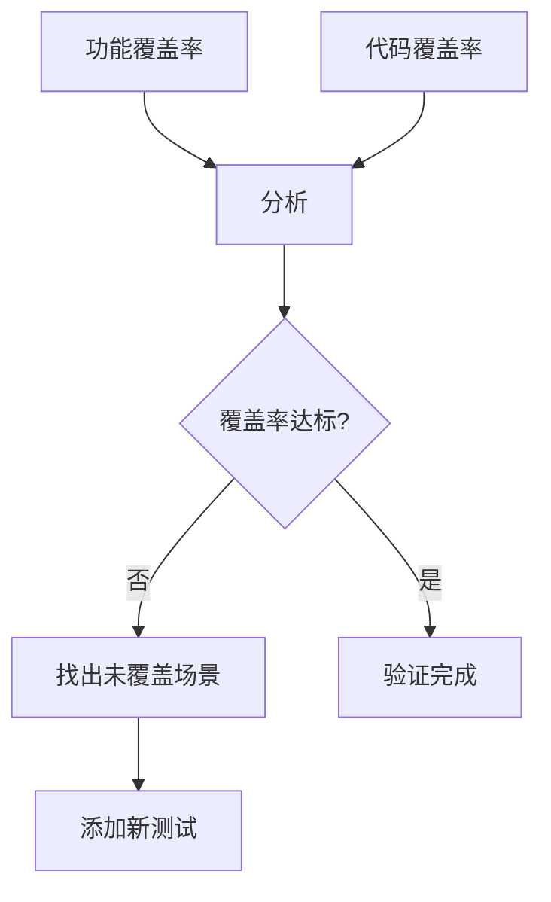
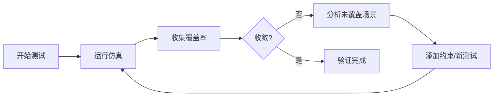

# 📊 寄存器覆盖率

## 概述

寄存器覆盖率连接功能覆盖率和代码覆盖率，实现完整验证闭环。


## 寄存器覆盖组

```systemverilog
class reg_coverage extends uvm_subscriber#(bus_trans);
    `uvm_component_utils(reg_coverage)
    
    // 覆盖率组
    covergroup reg_cg;
        // 寄存器地址覆盖
        REG_ADDR: coverpoint tr.addr {
            bins REGS[] = {
                'h0000, 'h0004, 'h0008, 'h000C,
                'h1000, 'h1004, 'h1008, 'h100C
            };
        }
        
        // 寄存器域覆盖
        REG_FIELD: coverpoint tr.addr {
            bins CTRL[] = {'h0000, 'h1000};
            bins STAT[] = {'h0004, 'h1004};
            bins DATA[] = {'h0008, 'h1008};
        }
        
        // 读写覆盖
        REG_RW: coverpoint tr.is_read {
            bins READ = {1};
            bins WRITE = {0};
        }
        
        // 交叉覆盖
        REG_ACCESS: cross REG_FIELD, REG_RW;
    endgroup
    
    // 覆盖率统计
    int read_access = 0;
    int write_access = 0;
    
    virtual function void write(T t);
        // 更新统计
        if (t.is_read) read_access++;
        else write_access++;
        
        void'(reg_cg.sample());
    endfunction
    
    virtual function real get_coverage();
        return reg_cg.get_inst_coverage();
    endfunction
endclass
```

## 寄存器模型集成

```systemverilog
// ==========================================
// 寄存器块定义
// ==========================================
class my_reg_block extends uvm_reg_block;
    `uvm_object_utils(my_reg_block)
    
    // 寄存器定义
    rand uvm_reg_field ctrl;
    rand uvm_reg_field stat;
    rand uvm_reg_data data;
    
    function void build();
        // 创建寄存器
        ctrl = uvm_reg_field::type_id::create("ctrl");
        stat = uvm_reg_field::type_id::create("stat");
        data = uvm_reg_data::type_id::create("data");
        
        // 配置寄存器
        ctrl.configure(this, 8, 0, "RW", 0, 'h00, 1, 0);
        stat.configure(this, 8, 8, "RO", 0, 'h00, 1, 0);
        data.configure(this, 8, 16, "RW", 0, 'h00, 1, 0);
        
        // 添加寄存器
        add_reg("ctrl", ctrl, "Reg0");
        add_reg("stat", stat, "Reg4");
        add_reg("data", data, "Reg8");
        
        // 锁定
        lock_model();
    endfunction
    
    function new(string name="my_reg_block");
        super.new(name);
    endfunction
endclass
```

## 功能覆盖率与代码覆盖率联动



## 覆盖率联动分析

```systemverilog
class coverage_integration extends uvm_subscriber#(bus_trans);
    `uvm_component_utils(coverage_integration)
    
    // 功能覆盖率
    functional_coverage func_cov;
    
    // 代码覆盖率
    code_coverage code_cov;
    
    // 覆盖率目标
    localparam FUNCTIONAL_GOAL = 80.0;
    localparam CODE_GOAL = 95.0;
    
    virtual function void write(T t);
        func_cov.write(t);
        code_cov.write(t);
    endfunction
    
    virtual function void report();
        real func_cov_pct = func_cov.get_coverage();
        real code_cov_pct = code_cov.get_coverage();
        
        `uvm_info("COV_ANALYSIS", 
            $sformatf("Functional: %0.1f%% (Goal: %0.0f%%)", 
                func_cov_pct, FUNCTIONAL_GOAL), UVM_LOW)
        `uvm_info("COV_ANALYSIS", 
            $sformatf("Code: %0.1f%% (Goal: %0.0f%%)", 
                code_cov_pct, CODE_GOAL), UVM_LOW)
        
        // 联动分析
        if (func_cov_pct >= FUNCTIONAL_GOAL && 
            code_cov_pct >= CODE_GOAL) begin
            `uvm_info("COV_PASS", "Coverage goals met!", UVM_LOW)
        end else begin
            if (func_cov_pct < FUNCTIONAL_GOAL)
                `uvm_warning("FUNC_LOW", 
                    "Functional coverage below target!")
            if (code_cov_pct < CODE_GOAL)
                `uvm_warning("CODE_LOW", 
                    "Code coverage below target!")
        end
    endfunction
endclass
```

## Mini SoC 寄存器覆盖

```systemverilog
// ==========================================
// Mini SoC 寄存器覆盖
// ==========================================
class mini_soc_reg_cov extends uvm_subscriber#(bus_trans);
    `uvm_component_utils(mini_soc_reg_cov)
    
    // UART 寄存器
    localparam UART_CTRL = 'h2000_0008;
    localparam UART_STAT = 'h2000_0004;
    localparam UART_DATA = 'h2000_0000;
    
    // Timer 寄存器
    localparam TIMER_CTRL = 'h3000_0008;
    localparam TIMER_VAL = 'h3000_0004;
    localparam TIMER_LOAD = 'h3000_0000;
    
    // DMA 寄存器
    localparam DMA_CTRL = 'h1000_0000;
    localparam DMA_SRC = 'h1000_0004;
    localparam DMA_DST = 'h1000_0008;
    localparam DMA_LEN = 'h1000_000C;
    
    covergroup soc_cg;
        // UART 访问覆盖
        UART: coverpoint tr.addr {
            bins UART_REGS[] = {UART_DATA, UART_STAT, UART_CTRL};
        }
        
        // Timer 访问覆盖
        TIMER: coverpoint tr.addr {
            bins TIMER_REGS[] = {TIMER_LOAD, TIMER_VAL, TIMER_CTRL};
        }
        
        // DMA 访问覆盖
        DMA: coverpoint tr.addr {
            bins DMA_REGS[] = {DMA_CTRL, DMA_SRC, DMA_DST, DMA_LEN};
        }
        
        // 各模块读写覆盖
        UART_RW: cross UART, is_read {
            bins UART_READ = binsof(UART) bins {UART_REGS} && 
                             binsof(is_read) bins {1};
        }
        
        TIMER_RW: cross TIMER, is_read {
            bins TIMER_WRITE = binsof(TIMER) bins {TIMER_REGS} && 
                               binsof(is_read) bins {0};
        }
    endgroup
    
    // 统计
    int uart_access = 0;
    int timer_access = 0;
    int dma_access = 0;
    
    virtual function void write(T t);
        case (t.addr)
            UART_DATA, UART_STAT, UART_CTRL: uart_access++;
            TIMER_LOAD, TIMER_VAL, TIMER_CTRL: timer_access++;
            DMA_CTRL, DMA_SRC, DMA_DST, DMA_LEN: dma_access++;
        endcase
        void'(soc_cg.sample());
    endfunction
    
    virtual function real get_coverage();
        return soc_cg.get_inst_coverage();
    endfunction
    
    virtual function void report();
        `uvm_info("SOC_COV", 
            $sformatf("UART: %0d, Timer: %0d, DMA: %0d",
                uart_access, timer_access, dma_access), UVM_LOW)
    endfunction
endclass
```

## 覆盖率收敛分析



## 覆盖率报告

```systemverilog
class coverage_report extends uvm_subscriber#(bus_trans);
    `uvm_component_utils(coverage_report)
    
    // 多个覆盖组
    reg_coverage reg_cov;
    func_coverage func_cov;
    cross_coverage cross_cov;
    
    // 覆盖率目标
    localparam REG_GOAL = 80.0;
    localparam FUNC_GOAL = 75.0;
    localparam CROSS_GOAL = 70.0;
    localparam OVERALL_GOAL = 75.0;
    
    virtual function void write(T t);
        reg_cov.write(t);
        func_cov.write(t);
        cross_cov.write(t);
    endfunction
    
    virtual function void report();
        real reg_c = reg_cov.get_coverage();
        real func_c = func_cov.get_coverage();
        real cross_c = cross_cov.get_coverage();
        real overall = (reg_c + func_c + cross_c) / 3;
        
        `uvm_info("=" , "=" , UVM_LOW)
        `uvm_info("COV_REPORT", "========== Coverage Report ==========", UVM_LOW)
        `uvm_info("COV_REPORT", 
            $sformatf("Register: %0.1f%% (Goal: %0.0f%%)", 
                reg_c, REG_GOAL), UVM_LOW)
        `uvm_info("COV_REPORT", 
            $sformatf("Functional: %0.1f%% (Goal: %0.0f%%)", 
                func_c, FUNC_GOAL), UVM_LOW)
        `uvm_info("COV_REPORT", 
            $sformatf("Cross: %0.1f%% (Goal: %0.0f%%)", 
                cross_c, CROSS_GOAL), UVM_LOW)
        `uvm_info("COV_REPORT", 
            $sformatf("Overall: %0.1f%% (Goal: %0.0f%%)", 
                overall, OVERALL_GOAL), UVM_LOW)
        `uvm_info("=" , "=" , UVM_LOW)
        
        if (overall >= OVERALL_GOAL)
            `uvm_info("PASS", "Coverage goals met!", UVM_LOW)
        else
            `uvm_warning("FAIL", "Coverage goals NOT met")
    endfunction
endclass
```

## 最佳实践

| 实践 | 说明 |
|------|------|
| 定义覆盖率目标 | 明确各类型覆盖率目标 |
| 分层收集 | 寄存器→功能→交叉 |
| 联动分析 | 功能+代码覆盖率联动 |
| 自动报告 | 仿真结束自动输出 |

## 常见问题

| 问题 | 解决方案 |
|------|----------|
| 覆盖率不涨 | 检查寄存器访问 |
| 目标不明确 | 设置分层目标 |
| 报告混乱 | 使用统一报告格式 |

## 进阶阅读

- [自动报告](04-auto-report/)
- [完整示例](../examples/)
