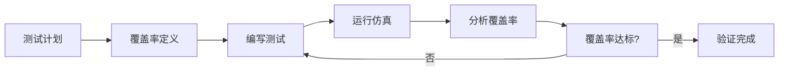
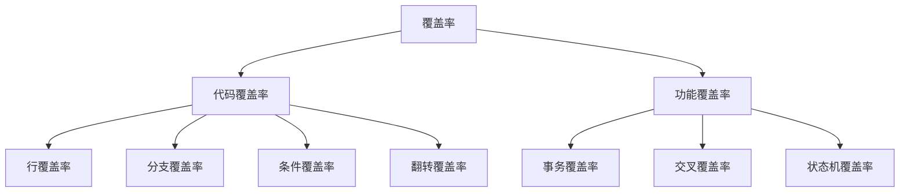
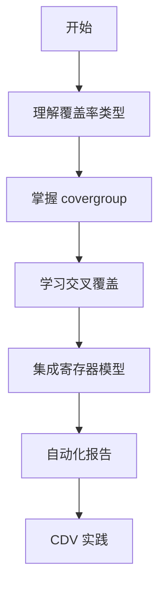

# 📊 覆盖率驱动验证 (CDV)

## 概述

覆盖率驱动验证（Coverage-Driven Verification, CDV）是一种以覆盖率为导向的验证方法学。



## 为什么需要 CDV？

| 指标 | 传统验证 | CDV |
|------|----------|------|
| 目标明确 | ❌ | ✅ |
| 进度可衡量 | ❌ | ✅ |
| 质量可控 | ❌ | ✅ |
| 自动化程度 | 低 | 高 |

## 覆盖率类型



## 目录

1. [覆盖率基础](01-fundamentals/) - 基本概念和收集
2. [交叉覆盖率](02-cross-coverage/) - 复杂覆盖模型
3. [寄存器覆盖率](03-reg-coverage/) - 与RAL联动
4. [自动报告](04-auto-report/) - uvm_subscriber和报告
5. [示例代码](examples/) - 完整可运行示例

## 核心工具

| 工具 | 用途 |
|------|------|
| `uvm_subscriber` | 覆盖率收集器基类 |
| `covergroup` | 覆盖率定义 |
| `cross` | 交叉覆盖 |
| `ignore_bins` | 忽略特定值 |

## 快速示例

```systemverilog
class bus_coverage extends uvm_subscriber#(bus_trans);
    covergroup cg;
        ADDR: coverpoint tr.addr {
            bins KB[] = {[0:'h1000]};
            bins MB[] = {['h1000:$]};
        }
        DATA: coverpoint tr.data;
        RW: coverpoint tr.is_read;
        ADDR_RW: cross ADDR, RW;
    endgroup
    
    virtual function void write(T t);
        void'(cg.sample());
    endfunction
endclass
```

## 学习路径



## 相关章节

- [UVM 组件](02-uvm-phases/)
- [TLM 通信](05-tlm-communication/)
- [寄存器模型](09-register-model-ral/)

## 在线资源

- [Coverage 官方指南](https://verificationacademy.com/)
- [EDA Playground](https://edaplayground.com/)
