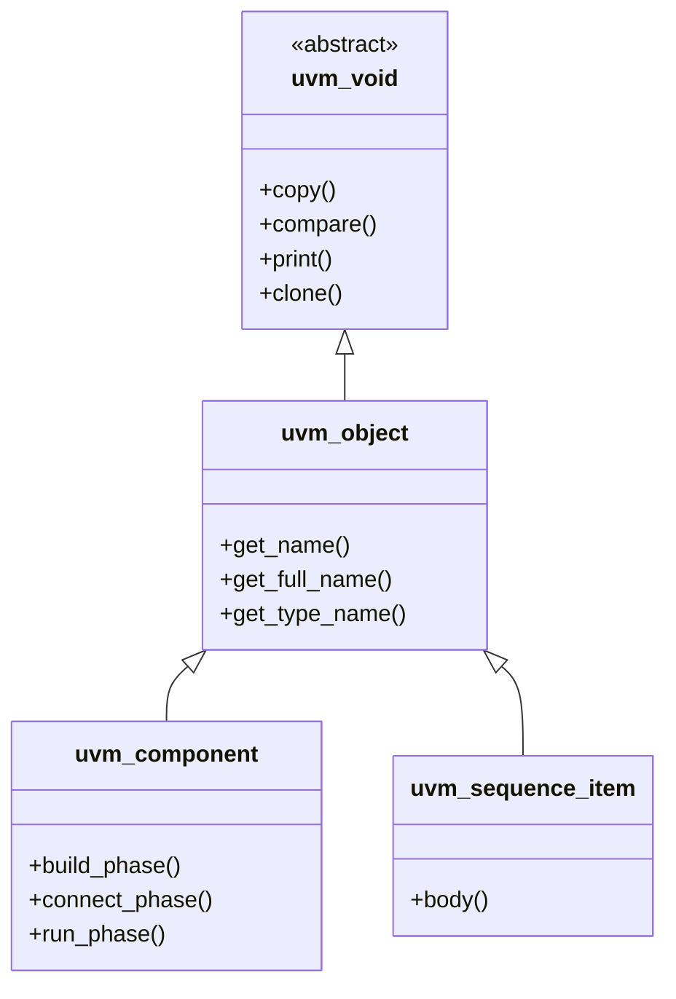
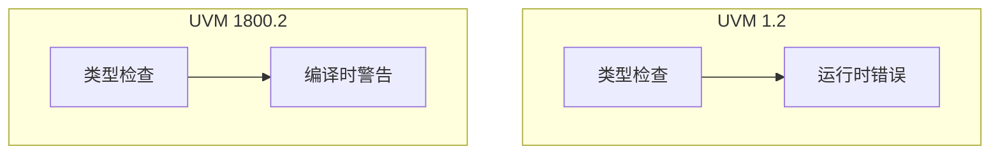

# 📚 虚拟类层次 - uvm_void 详解

## uvm_void 概述

`uvm_void` 是所有 UVM 类的根类，提供通用的对象功能。



## uvm_void 的作用

```systemverilog
// UVM 1.2
class my_driver extends uvm_driver#(bus_trans);
    // 必须继承 uvm_driver
endclass

// UVM 1800.2 - 更灵活的层次
class my_driver extends uvm_component;
    // 通用组件，更少的约束
endclass
```

## 类型安全改进



## 代码示例

```systemverilog
// uvm_void 示例
class base_sequence extends uvm_sequence#(bus_trans);
    `uvm_object_utils(base_sequence)
    
    virtual task body();
        `uvm_info("SEQ", "Base sequence body", UVM_LOW)
    endtask
    
    // 可选：自定义行为
    virtual function void pre_body();
        // UVM 1800.2 中更灵活
    endfunction
endclass
```

## 最佳实践

| 实践 | 说明 |
|------|------|
| 使用 `uvm_void` 作为通用句柄 | 减少类型耦合 |
| 避免直接实例化 `uvm_void` | 它是抽象类 |
| 利用类型转换 | `$cast()` 更安全 |

## 进阶阅读

- [UVM 核心服务](02-new-features/)
- [迁移指南](03-migration-guide/)
