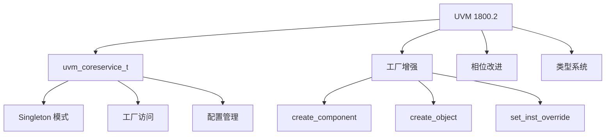
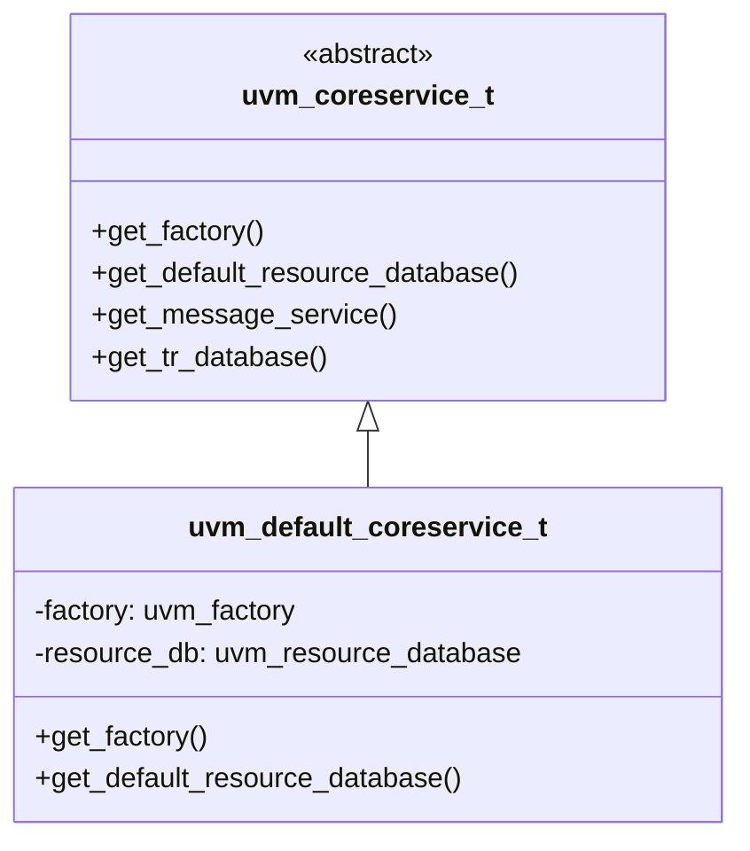
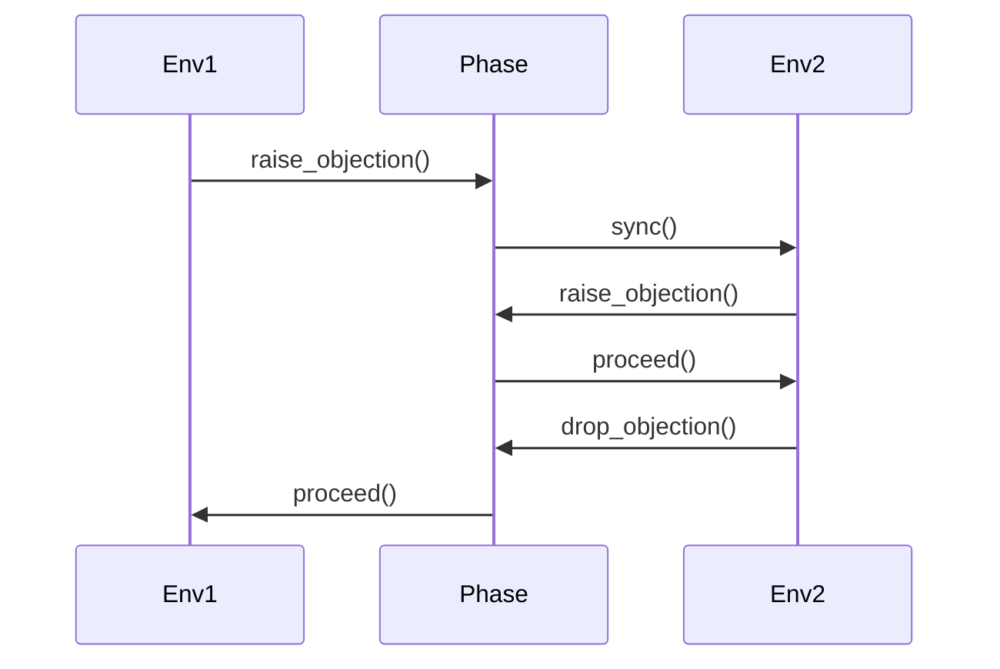

# 🚀 UVM 1800.2 新特性详解

## 特性概览



## 1. uvm_coreservice_t

### 概述

`uvm_coreservice_t` 是 UVM 1800.2 引入的核心服务抽象，提供统一的工厂和配置访问。



### 代码示例

```systemverilog
// UVM 1.2 方式
class my_test extends uvm_test;
    `uvm_component_utils(my_test)
    
    function void build_phase(uvm_phase phase);
        // 直接访问全局工厂
        factory = uvm_factory::get();
    endfunction
endclass

// UVM 1800.2 方式
class my_test extends uvm_test;
    `uvm_component_utils(my_test)
    
    uvm_coreservice_t cs;
    uvm_factory factory;
    
    function void build_phase(uvm_phase phase);
        // 通过核心服务访问
        cs = uvm_coreservice_t::get();
        factory = cs.get_factory();
    endfunction
endclass
```

### 优势

| 优势 | 说明 |
|------|------|
| **解耦** | 减少对全局变量的依赖 |
| **可测试性** | 更容易 Mock 和 Stub |
| **可扩展性** | 可自定义核心服务 |
| **线程安全** | 更好的并发支持 |

## 2. 工厂 API 增强

### create_component 改进

```systemverilog
// UVM 1.2
driver = driver_t::type_id::create("driver", this);

// UVM 1800.2 - 更多选项
driver = factory.create_component(
    "driver",
    this,
    "driver"
);

// 带配置创建
driver = factory.create_component(
    "driver",
    this,
    "driver",
    .context(this.get_full_name())
);
```

### create_object 改进

```systemverilog
// UVM 1.2
trans = bus_trans::type_id::create("trans");

// UVM 1800.2 - 更灵活的创建
trans = factory.create_object(
    "trans",
    .context(this.get_full_name())
);
```

### 覆盖注册改进

```systemverilog
// UVM 1.2
`uvm_component_utils(my_driver)
`uvm_object_utils(my_sequence)

// UVM 1800.2 - 推荐方式
`uvm_component_registry(my_driver, "my_driver")
`uvm_object_registry(my_sequence, "my_sequence")

// 或直接使用静态注册
class my_driver extends uvm_driver;
    static function uvm_object_registry#(my_driver, "my_driver") get_type();
    endfunction
endclass
```

## 3. 相位控制增强

### uvm_void 相位

```systemverilog
// UVM 1800.2 - 更灵活的相位控制
class my_phase extends uvm_task_phase;
    virtual task body(uvm_phase phase);
        // 自定义相位行为
        `uvm_info("PHASE", "Custom phase", UVM_LOW)
    endtask
endclass
```

### 相位同步



## 4. 资源管理增强

### 资源数据库

```systemverilog
// UVM 1800.2 - 更好的资源管理
class my_config extends uvm_object;
    `uvm_object_utils(my_config)
    
    int num_items = 10;
    bit enable_debug = 0;
endclass

// 创建配置
my_config cfg = my_config::type_id::create("cfg");
cfg.num_items = 20;

// 存入数据库
uvm_resource_db#(my_config)::set("my_agent", "*", cfg);

// 从数据库获取
my_config cfg;
if (uvm_resource_db#(my_config)::read_by_name(
    "my_agent", "cfg", cfg)) begin
    `uvm_info("CFG", $sformatf("num=%0d", cfg.num_items), UVM_LOW)
end
```

## 在线运行

运行 UVM 1800.2 示例：

[:fontawesome-solid-play: EDA Playground](https://edaplayground.com/){ .md-button .md-button--primary }

## 练习

1. 实现自定义 `uvm_coreservice_t`
2. 使用新的工厂 API 重构现有组件
3. 创建自定义相位

## 进阶阅读

- [迁移指南](03-migration-guide/)
- [版本对比](04-version-comparison/)
