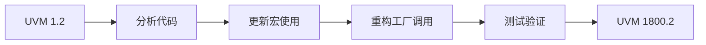

# 📖 UVM 1.2 → 1800.2 迁移指南

## 迁移概览



## 迁移检查清单

- [ ] 识别所有 `uvm_*_utils` 宏使用
- [ ] 更新工厂调用方式
- [ ] 检查相位控制代码
- [ ] 验证资源管理
- [ ] 测试覆盖率

## 1. 宏迁移

### `uvm_component_utils

```systemverilog
// ❌ UVM 1.2 - 旧方式
class my_driver extends uvm_driver#(bus_trans);
    `uvm_component_utils(my_driver)
endclass

// ✅ UVM 1800.2 - 新方式
class my_driver extends uvm_driver#(bus_trans);
    `uvm_component_registry(my_driver, "my_driver")
    
    // 可选：覆盖 get_type()
    static function uvm_object_registry#(my_driver) get_type();
        return uvm_object_registry#(my_driver)::get();
    endfunction
endclass
```

### `uvm_object_utils

```systemverilog
// ❌ UVM 1.2
class my_sequence extends uvm_sequence#(bus_trans);
    `uvm_object_utils(my_sequence)
endclass

// ✅ UVM 1800.2
class my_sequence extends uvm_sequence#(bus_trans);
    `uvm_object_registry(my_sequence, "my_sequence")
endclass
```

### 自动化迁移脚本

```python
#!/usr/bin/env python3
"""UVM 宏迁移脚本"""

import re

MIGRATION_MAP = {
    '`uvm_component_utils(': '`uvm_component_registry(',
    '`uvm_object_utils(': '`uvm_object_registry(',
    '`uvm_field_utils(': '`uvm_field_int(',
}

def migrate_file(filename):
    with open(filename, 'r') as f:
        content = f.read()
    
    for old, new in MIGRATION_MAP.items():
        content = content.replace(old, new)
    
    with open(filename, 'w') as f:
        f.write(content)
```

## 2. 工厂调用迁移

### type_id::create

```systemverilog
// ❌ UVM 1.2
class my_test extends uvm_test;
    virtual function void build_phase(uvm_phase phase);
        driver = my_driver::type_id::create("driver", this);
    endfunction
endclass

// ✅ UVM 1800.2
class my_test extends uvm_test;
    uvm_factory factory;
    
    virtual function void build_phase(uvm_phase phase);
        uvm_coreservice_t cs = uvm_coreservice_t::get();
        factory = cs.get_factory();
        
        driver = factory.create_component(
            "my_driver",
            this,
            "driver"
        );
    endfunction
endclass
```

### set_type_override

```systemverilog
// ❌ UVM 1.2
initial begin
    my_driver::type_id::set_inst_override(
        my_new_driver::get_type(),
        "*.agent.drv"
    );
end

// ✅ UVM 1800.2
initial begin
    uvm_factory factory = uvm_factory::get();
    factory.set_inst_override(
        my_new_driver::get_type(),
        "*.agent.drv"
    );
end
```

## 3. 相位迁移

### 自定义任务相位

```systemverilog
// ❌ UVM 1.2
class my_phase extends uvm_task_phase;
    virtual task body(uvm_phase phase);
        // 旧方式
    endtask
endclass

// ✅ UVM 1800.2
class my_phase extends uvm_task_phase;
    virtual task body(uvm_phase phase);
        // 新方式：更好的异常处理
        fork
            begin
                // 异步操作
            end
        join_none
        
        // 等待所有子任务完成
        phase.wait_for(UVM_ALL_DROPPED);
    endtask
endclass
```

### 同步点

```systemverilog
// UVM 1800.2 - 更清晰的同步
class my_env extends uvm_env;
    uvm_barrier sync_barrier;
    
    function void build_phase(uvm_phase phase);
        sync_barrier = new("sync", 2);  // 2 个参与者
    endfunction
    
    task run_phase(uvm_phase phase);
        // Agent 1
        fork
            begin
                #100;
                sync_barrier.wait_for();
            end
        join_none
        
        // Agent 2
        fork
            begin
                #200;
                sync_barrier.wait_for();
            end
        join_none
    endtask
endclass
```

## 4. 配置迁移

### uvm_config_db

```systemverilog
// ❌ UVM 1.2
class my_agent extends uvm_agent;
    virtual bus_if vif;
    
    virtual function void build_phase(uvm_phase phase);
        if (!uvm_config_db#(virtual bus_if)::get(
            this, "", "vif", vif)) begin
            `uvm_fatal("CFG", "Cannot get vif")
        end
    endfunction
endclass

// ✅ UVM 1800.2 - 更好的错误处理
class my_agent extends uvm_agent;
    virtual bus_if vif;
    
    virtual function void build_phase(uvm_phase phase);
        uvm_resource_db#(virtual bus_if)::read_by_name(
            get_full_name(), "vif", vif,
            function void input #(virtual bus_if arg);
                vif = arg;
            endfunction
        );
        
        if (vif == null)
            `uvm_fatal("CFG", "Cannot get vif")
    endfunction
endclass
```

## 5. 完整迁移示例

### Before (UVM 1.2)

```systemverilog
`include "uvm_macros.svh"

class bus_driver extends uvm_driver#(bus_trans);
    `uvm_component_utils(bus_driver)
    
    virtual bus_if vif;
    
    function void build_phase(uvm_phase phase);
        if (!uvm_config_db#(virtual bus_if)::get(
            this, "", "vif", vif))
            `uvm_fatal("CFG", "Cannot get vif")
    endfunction
    
    task run_phase(uvm_phase phase);
        forever begin
            seq_item_port.get_next_item(req);
            drive(req);
            seq_item_port.item_done();
        end
    endtask
endclass
```

### After (UVM 1800.2)

```systemverilog
`include "uvm_macros.svh"

class bus_driver extends uvm_driver#(bus_trans);
    `uvm_component_registry(bus_driver, "bus_driver")
    
    virtual bus_if vif;
    uvm_factory factory;
    
    function void build_phase(uvm_phase phase);
        uvm_coreservice_t cs = uvm_coreservice_t::get();
        factory = cs.get_factory();
        
        if (!uvm_config_db#(virtual bus_if)::get(
            this, "", "vif", vif))
            `uvm_fatal("CFG", "Cannot get vif")
    endfunction
    
    task run_phase(uvm_phase phase);
        forever begin
            seq_item_port.get_next_item(req);
            drive(req);
            seq_item_port.item_done();
        end
    endtask
endclass
```

## 迁移工具

```bash
# 使用 Python 脚本迁移
python3 scripts/migrate_uvm.py --src ./tb --dst ./tb_migrated
```

## 验证迁移

```systemverilog
// 迁移后验证代码
initial begin
    uvm_factory factory = uvm_factory::get();
    
    // 检查所有注册类型
    factory.print();
    
    // 验证工厂覆盖
    factory.set_type_override("my_driver", "my_new_driver");
end
```

## 常见问题

| 问题 | 解决方案 |
|------|----------|
| 宏不识别 | 确保包含正确的头文件 |
| 工厂为空 | 检查核心服务初始化 |
| 相位卡住 | 使用更好的同步机制 |
| 配置不生效 | 使用资源数据库替代 |

## 进阶阅读

- [新特性详解](../02-new-features/)
- [版本对比](../04-version-comparison/)
