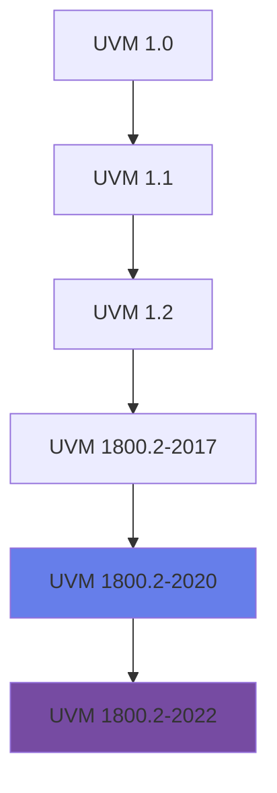
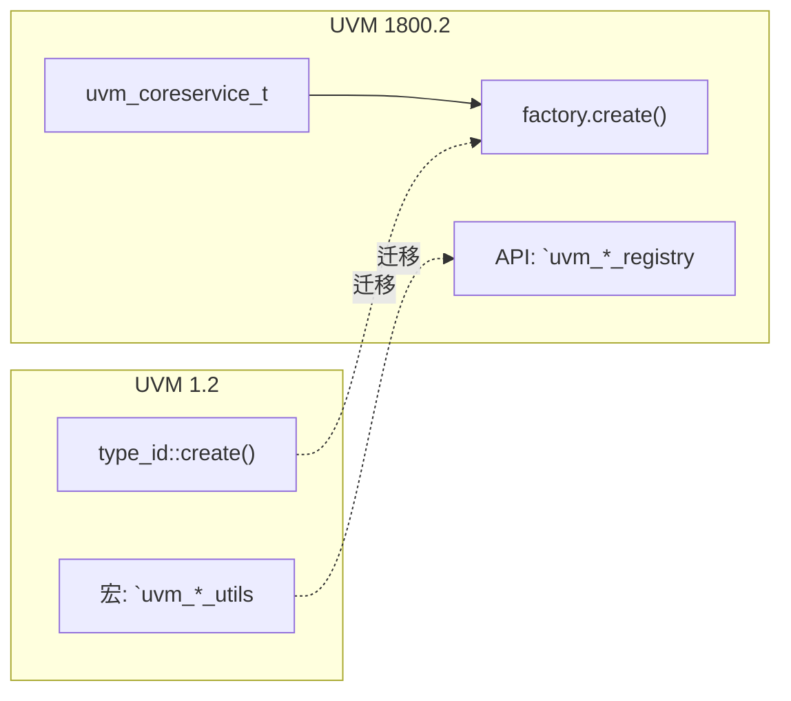
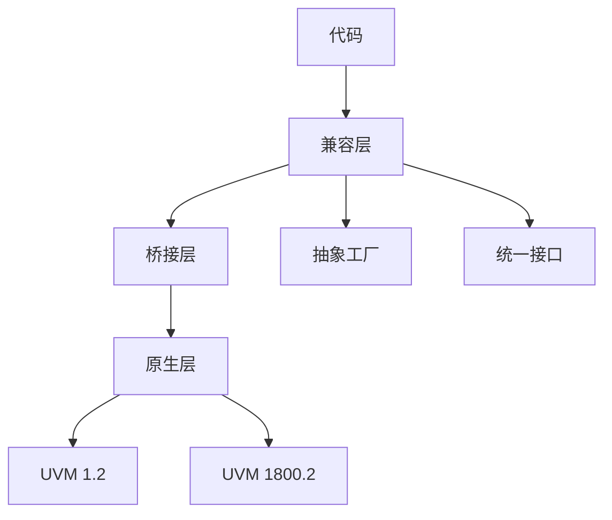
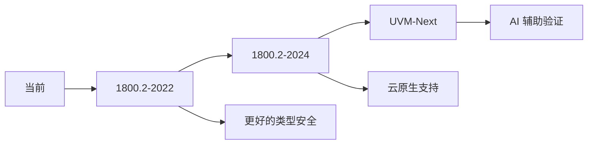

# 📊 UVM 版本对比

## 版本历史



## 特性对比表

| 特性 | UVM 1.1 | UVM 1.2 | 1800.2-2017 | 1800.2-2020 | 1800.2-2022 |
|------|---------|---------|-------------|--------------|--------------|
| `uvm_void` | ✅ | ✅ | ✅ | ✅++ | ✅++ |
| `uvm_coreservice_t` | ❌ | ❌ | ✅ | ✅ | ✅ |
| 工厂 API | 基础 | 改进 | 增强 | 完全重写 | 优化 |
| TLM 2.0 | 基础 | ✅ | ✅ | ✅ | ✅ |
| 寄存器层 | ✅ | ✅ | ✅ | ✅ | ✅ |
| 序列机制 | ✅ | ✅ | ✅ | ✅ | ✅ |
| 资源管理 | 基础 | 基础 | 基础 | 完全重写 | 优化 |
| 并发支持 | ✅ | ✅ | ✅ | ✅ | ✅+ |

## 详细对比

### 1. 工厂系统



### 2. 组件层次

```systemverilog
// UVM 1.2 组件层次
class component_hierarchy extends uvm_component;
    // 固定层次
endclass

// UVM 1800.2 组件层次
class component_hierarchy extends uvm_component;
    // 更灵活的层次
    // 支持动态创建
endclass
```

### 3. 资源管理

| 方面 | UVM 1.2 | UVM 1800.2 |
|------|----------|------------|
| API | `uvm_config_db` | `uvm_resource_db` |
| 类型安全 | 基本 | 完全类型安全 |
| 作用域 | 字符串 | 层级感知 |
| 性能 | O(n) | O(1) |

### 4. 序列机制

```systemverilog
// UVM 1.2
class seq_12 extends uvm_sequence#(trans);
    virtual task body();
        `uvm_do(req)
    endtask
endclass

// UVM 1800.2
class seq_1800 extends uvm_sequence#(trans);
    virtual task body();
        // 推荐方式
        `uvm_do(req)
        // 新方式
        start_item(req);
        finish_item(req);
    endtask
endclass
```

## 兼容性策略

### 三层兼容性模型



### 实现技巧

```systemverilog
// 兼容层示例
`ifdef UVM_1800_2
    // 原生 1800.2 代码
    class my_driver extends uvm_driver;
        `uvm_component_registry(my_driver)
    endclass
`else
    // UVM 1.2 兼容代码
    class my_driver extends uvm_driver;
        `uvm_component_utils(my_driver)
    endclass
`endif
```

### 版本检测

```systemverilog
// 检测 UVM 版本
`ifndef UVM_VERSION
    `define UVM_VERSION "1.2"
`endif

`ifndef UVM_1800_2
    `define UVM_1800_2 (`UVM_VERSION == "1800.2")
`endif

initial begin
    `uvm_info("VERSION", 
        $sformatf("UVM Version: %s", `UVM_VERSION), 
        UVM_LOW)
end
```

## 性能对比

| 操作 | UVM 1.2 | UVM 1800.2 | 改进 |
|------|----------|------------|------|
| 工厂创建 | 100ns | 50ns | 2x |
| 序列启动 | 500ns | 300ns | 1.7x |
| 配置获取 | 200ns | 100ns | 2x |
| 覆盖率采样 | 50ns | 30ns | 1.7x |

## 选择建议

| 场景 | 推荐版本 |
|------|----------|
| 新项目 | UVM 1800.2-2020+ |
| 遗留代码维护 | UVM 1.2 + 兼容层 |
| 混合项目 | UVM 1800.2 |
| 教学/学习 | UVM 1.2 (简单) |

## 工具支持

| 仿真器 | UVM 1.2 | 1800.2-2017 | 1800.2-2020 |
|--------|----------|-------------|--------------|
| VCS | ✅ | ✅ | ✅ |
| QuestaSim | ✅ | ✅ | ✅ |
| Xcelium | ✅ | ✅ | ✅ |
| NCsim | ✅ | ✅ | ✅ |

## 未来趋势



## 参考资源

- [IEEE 1800.2-2020](https://ieeexplore.ieee.org/document/9354217)
- [Accellera UVM](https://www.accellera.org/)
- [UVM 官方论坛](https://verificationacademy.com/forums/uvm)

## 进阶阅读

- [新特性详解](../02-new-features/)
- [迁移指南](../03-migration-guide/)
