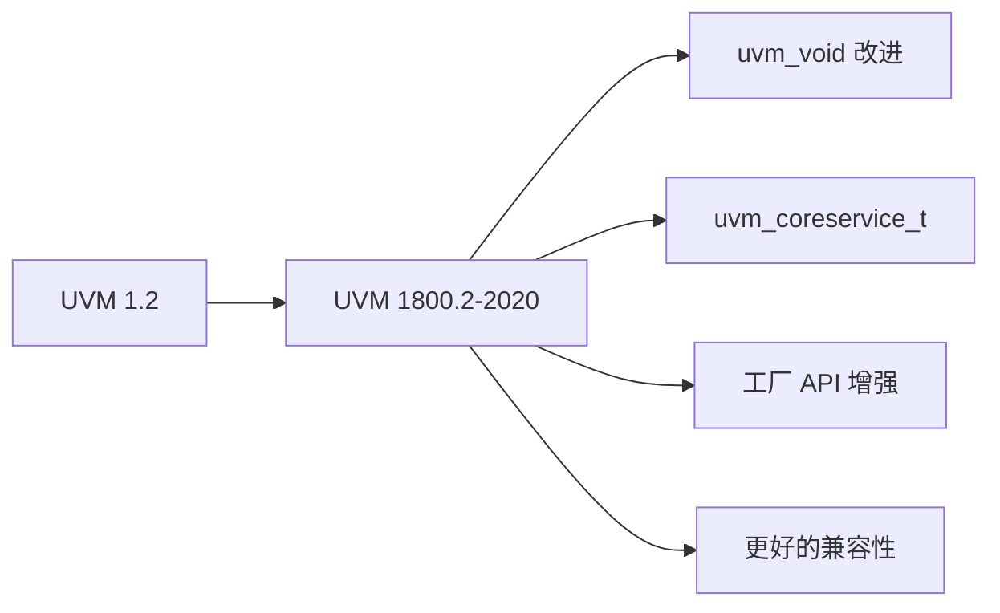

# UVM 1800.2-2020 新特性

## 概述

UVM 1800.2-2020 是 UVM 的重要更新版本，引入了多项工业级改进。

## 主要变更

| 特性 | UVM 1.2 | UVM 1800.2 | 说明 |
|------|----------|------------|------|
| `uvm_void` | 基础 | 增强 | 更灵活的相位控制 |
| `uvm_coreservice_t` | 无 | 新增 | 核心服务抽象 |
| `uvm_root` | 独立 | 集成 | 更好的工厂控制 |
| 工厂注册 | 宏 | API | 减少宏依赖 |

## 目录

1. [虚拟类层次](01-virtual-class/) - `uvm_void` 和类型系统
2. [新特性详解](02-new-features/) - 核心服务、工厂改进
3. [迁移指南](03-migration-guide/) - 从 1.2 迁移
4. [版本对比](04-version-comparison/) - 兼容性技巧

## 在线资源

- [UVM 1800.2-2020 标准](https://www.accellera.org/)
- [IEEE 1800.2-2020](https://ieeexplore.ieee.org/document/9354217)

## 代码示例

查看 `examples/uvm-1800-2/` 目录获取完整示例。
