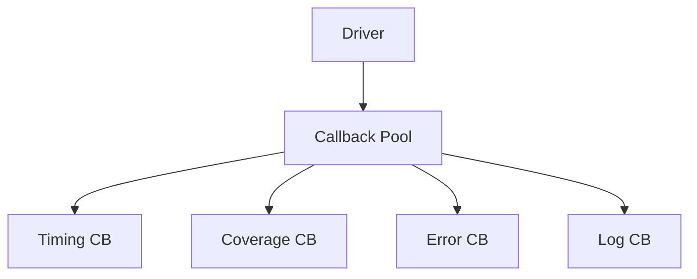

# 🚀 UVM 回调高级用法

## 多回调管理



## 动态回调注册

```systemverilog
// 动态添加回调
class dynamic_test extends uvm_test;
    monitored_driver drv;
    timing_callback timing_cb;
    coverage_callback cov_cb;
    
    virtual function void build_phase(uvm_phase phase);
        drv = monitored_driver::type_id::create("drv", this);
    endfunction
    
    virtual task run_phase(uvm_phase phase);
        #100;  // 等待一些事务
        
        // 动态添加回调
        timing_cb = new("timing_cb");
        uvm_callbacks#(monitored_driver)::add(drv, timing_cb);
        
        #100;
        
        // 动态移除回调
        uvm_callbacks#(monitored_driver)::delete(drv, timing_cb);
        
        #100;
        
        // 重新添加
        cov_cb = new("cov_cb");
        uvm_callbacks#(monitored_driver)::add(drv, cov_cb);
    endtask
endclass
```

## 自定义回调池

```systemverilog
// ==========================================
// 自定义回调池
// ==========================================
class my_callback_pool extends uvm_callbacks#(my_driver, my_callback);
    `uvm_object_utils(my_callback_pool)
    
    // 自定义管理函数
    static function void enable_timing(bool en=true);
        timing_enabled = en;
    endfunction
    
    static bit timing_enabled = 0;
endclass

// 在 Driver 中使用
class my_driver extends uvm_driver#(bus_trans);
    virtual task run_phase(uvm_phase phase);
        forever begin
            seq_item_port.get_next_item(req);
            
            if (my_callback_pool::timing_enabled)
                my_callback_pool::pre_send(this, req);
            
            drive(req);
            
            if (my_callback_pool::timing_enabled)
                my_callback_pool::post_send(this, req);
            
            seq_item_port.item_done();
        end
    endtask
endclass
```

## 条件回调

```systemverilog
// 条件回调示例
class error_inject_callback extends uvm_callback;
    `uvm_object_utils(error_inject_callback)
    
    int error_rate = 10;  // 10% 错误率
    
    virtual task pre_send(uvm_driver#(bus_trans) drv, 
                          bus_trans tr);
        if ($urandom_range(100) < error_rate) begin
            tr.data = 'x;  // 注入错误
            `uvm_info("ERR_CB", "Error injected!", UVM_LOW)
        end
    endtask
endclass
```

## 回调优先级

```systemverilog
// 通过注册顺序控制优先级
class high_priority_cb extends uvm_callback;
    virtual task pre_send(uvm_driver#(bus_trans) drv, 
                          bus_trans tr);
        `uvm_info("HIGH", "High priority CB", UVM_LOW)
    endtask
endclass

class low_priority_cb extends uvm_callback;
    virtual task pre_send(uvm_driver#(bus_trans) drv, 
                          bus_trans tr);
        `uvm_info("LOW", "Low priority CB", UVM_LOW)
    endtask
endclass

// 高优先级先注册
class priority_test extends uvm_test;
    virtual function void build_phase(uvm_phase phase);
        high_priority_cb high = new("high");
        low_priority_cb low = new("low");
        
        // 高优先级先注册，先执行
        uvm_callbacks#(driver)::add(null, high);
        uvm_callbacks#(driver)::add(null, low);
    endfunction
endclass
```

## 回调与虚接口

```systemverilog
class monitor_callback extends uvm_callback;
    virtual bus_if vif;
    
    virtual task observed(uvm_monitor#(bus_trans) mon, 
                          bus_trans tr);
        // 通过回调访问虚接口
        if (vif !== null) begin
            bit [31:0] value = vif.data;
            `uvm_info("VIF_CB", $sformatf("Sampled: 0x%0h", value), UVM_LOW)
        end
    endtask
endclass

class monitor_with_cb extends uvm_monitor#(bus_trans);
    typedef uvm_callbacks#(monitor_with_cb, 
                          monitor_callback) cb_pool_t;
    
    virtual function void build_phase(uvm_phase phase);
        monitor_callback cb = new("cb");
        cb.vif = this.vif;
        cb_pool_t::add(this, cb);
    endtask
endclass
```

## 错误注入完整示例

```systemverilog
// ==========================================
// 错误注入回调
// ==========================================
class error_inject_callback extends uvm_callback;
    `uvm_object_utils(error_inject_callback)
    
    typedef enum {NONE, ADDR_ERROR, DATA_ERROR, TIMEOUT_ERROR} 
        error_type_t;
    
    error_type_t inject_type = DATA_ERROR;
    int error_rate = 5;
    
    virtual task pre_send(uvm_driver#(bus_trans) drv, 
                          bus_trans tr);
        if ($urandom_range(100) < error_rate) begin
            case (inject_type)
                ADDR_ERROR: tr.addr[0] = 1'bx;
                DATA_ERROR: tr.data = '0;
                TIMEOUT_ERROR: begin
                    // 延迟注入
                    fork
                        begin
                            #100;
                            tr.data = 'x;
                        end
                    join_none
                end
            endcase
            `uvm_warning("ERR_INJECT", 
                $sformatf("Injected %0s error", inject_type.name()))
        end
    endtask
endclass

// ==========================================
// 使用错误注入
// ==========================================
class error_injection_test extends uvm_test;
    `uvm_component_utils(error_injection_test)
    
    monitored_driver drv;
    error_inject_callback err_cb;
    
    virtual function void build_phase(uvm_phase phase);
        drv = monitored_driver::type_id::create("drv", this);
        
        // 注入 10% 错误率
        err_cb = new("err_cb");
        err_cb.error_rate = 10;
        err_cb.inject_type = error_inject_callback::DATA_ERROR;
        
        uvm_callbacks#(monitored_driver)::add(drv, err_cb);
    endfunction
endclass
```

## 性能监控回调

```systemverilog
class performance_callback extends uvm_callback;
    `uvm_object_utils(performance_callback)
    
    int transaction_count = 0;
    time total_time = 0;
    time last_time;
    
    virtual task pre_send(uvm_driver#(bus_trans) drv, 
                          bus_trans tr);
        last_time = $realtime();
    endtask
    
    virtual task post_send(uvm_driver#(bus_trans) drv,
                           bus_trans tr);
        time now = $realtime();
        total_time += (now - last_time);
        transaction_count++;
    endtask
    
    virtual function void report();
        real avg_latency = total_time / transaction_count;
        `uvm_info("PERF", 
            $sformatf("Transactions: %0d, Avg Latency: %0t", 
                transaction_count, avg_latency), UVM_LOW)
    endfunction
endclass
```

## 最佳实践

| 实践 | 说明 |
|------|------|
| 避免复杂逻辑 | 回调应保持简单 |
| 使用条件回调 | 按需启用/禁用 |
| 文档化 | 记录回调行为 |
| 测试覆盖率 | 确保回调被调用 |

## 常见问题

| 问题 | 解决方案 |
|------|----------|
| 性能影响 | 仅在需要时启用 |
| 调试困难 | 使用 `display()` 查看已注册回调 |
| 顺序依赖 | 避免依赖特定执行顺序 |

## 进阶阅读

- [工厂对比](../03-factory-comparison/)
- [官方文档](https://verificationacademy.com/)
