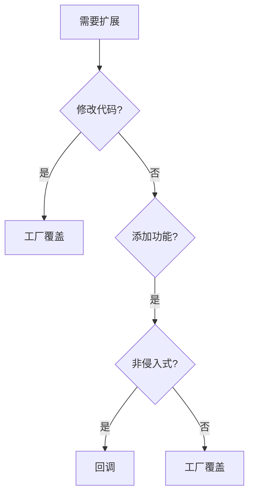
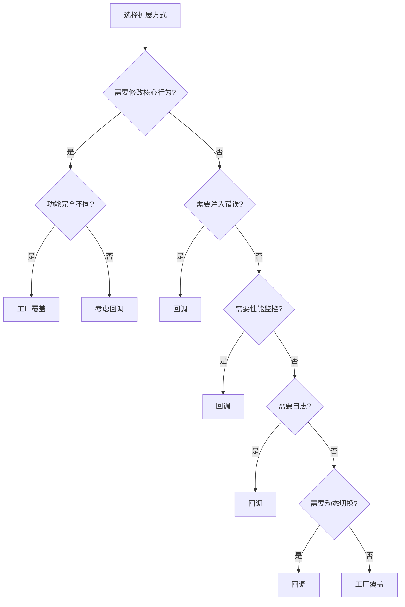
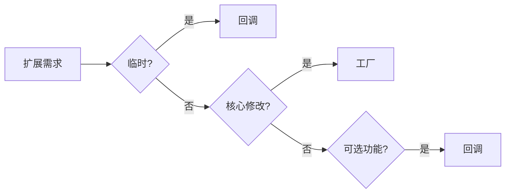

# 📊 回调 vs 工厂覆盖

## 对比概览



## 功能对比

| 特性 | 工厂覆盖 | 回调 |
|------|----------|------|
| **修改行为** | ✅ 完全替换 | ❌ 仅添加 |
| **添加日志** | ✅ | ✅ |
| **错误注入** | ❌ | ✅ |
| **性能监控** | ❌ | ✅ |
| **动态切换** | ❌ | ✅ |
| **简单易用** | ⭐⭐⭐ | ⭐⭐⭐⭐ |

## 使用场景

### 工厂覆盖 - 场景

```systemverilog
// 需要完全替换 Driver 行为
class new_driver extends uvm_driver#(bus_trans);
    // 全新驱动逻辑
    virtual task run_phase(uvm_phase phase);
        forever begin
            // 完全不同的实现
        end
    endtask
endclass

// 注册覆盖
initial begin
    uvm_factory::get().set_type_override_by_type(
        old_driver::get_type(), 
        new_driver::get_type()
    );
end
```

### 回调 - 场景

```systemverilog
// 添加性能监控
class perf_monitor_cb extends uvm_callback;
    virtual task pre_send(uvm_driver#(bus_trans) drv, 
                          bus_trans tr);
        // 仅添加监控，不修改核心逻辑
        $system("perf stat &");
    endtask
endclass
```

## 决策树



## 组合使用

```systemverilog
// 工厂覆盖 + 回调组合
class enhanced_driver extends uvm_driver#(bus_trans);
    typedef uvm_callbacks#(enhanced_driver, 
                           timing_callback) cb_pool_t;
    
    // 工厂覆盖会创建这个类
    virtual task run_phase(uvm_phase phase);
        forever begin
            seq_item_port.get_next_item(req);
            cb_pool_t::pre_send(this, req);
            drive(req);  // 覆盖的驱动逻辑
            cb_pool_t::post_send(this, req);
            seq_item_port.item_done();
        end
    endtask
endclass

class enhanced_test extends uvm_test;
    virtual function void build_phase(uvm_phase phase);
        // 工厂覆盖
        uvm_factory::get().set_type_override_by_type(
            base_driver::get_type(),
            enhanced_driver::get_type()
        );
        
        // 添加回调
        timing_callback cb = new("timing");
        uvm_callbacks#(enhanced_driver)::add(null, cb);
    endfunction
endclass
```

## 性能对比

| 操作 | 工厂覆盖 | 回调 |
|------|----------|------|
| 创建开销 | 中等 (对象创建) | 低 (函数调用) |
| 运行时开销 | 无 | 每次调用 |
| 内存开销 | 中等 | 低 |

## 代码示例对比

### 工厂覆盖

```systemverilog
// 原类
class base_driver extends uvm_driver#(bus_trans);
    virtual task drive(bus_trans t);
        // 基本驱动
    endtask
endclass

// 覆盖类
class fast_driver extends base_driver;
    virtual task drive(bus_trans t);
        // 更快实现
        #1ns;
    endtask
endclass

// 注册覆盖
initial begin
    fast_driver::type_id::set_inst_override(
        fast_driver::get_type(), "*.agent.*"
    );
end
```

### 回调

```systemverilog
// 回调类
class timing_cb extends uvm_callback;
    virtual task pre_send(base_driver drv, bus_trans t);
        `uvm_info("TIMING", $sformatf("Start: %0t", $time), UVM_LOW)
    endtask
endclass

// 注册回调
initial begin
    timing_cb cb = new("timing");
    uvm_callbacks#(base_driver)::add(null, cb);
end
```

## 选择指南

| 需求 | 推荐 |
|------|------|
| 完全重写组件 | 工厂覆盖 |
| 添加可选功能 | 回调 |
| 注入错误 | 回调 |
| 性能分析 | 回调 |
| 运行时切换 | 回调 |
| 简化验证平台 | 回调 |
| 复杂扩展 | 工厂覆盖 |

## 最佳实践

### 推荐顺序

1. **优先使用回调** - 非侵入，更灵活
2. **必要时使用工厂** - 完全替换行为
3. **组合使用** - 利用各自优势

### 代码组织

```systemverilog
// 推荐：回调为主
class my_test extends uvm_test;
    // 添加功能回调
    virtual function void build_phase(uvm_phase phase);
        // 日志回调
        uvm_callbacks#(driver)::add(drv, 
            logging_callback::get());
        
        // 性能回调（可选）
        if (enable_perf) begin
            uvm_callbacks#(driver)::add(drv, 
                perf_callback::get());
        end
        
        // 仅当需要时才用工厂覆盖
        if (use_fast_driver) begin
            uvm_factory::get().set_type_override_by_type(
                slow_driver::get_type(),
                fast_driver::get_type()
            );
        end
    endfunction
endclass
```

## 常见问题

| 问题 | 解决方案 |
|------|----------|
| 什么时候用工厂？ | 需要完全替换组件时 |
| 什么时候用回调？ | 添加可选功能时 |
| 能同时用吗？ | ✅ 组合使用 |
| 性能影响？ | 回调有轻微开销 |

## 总结



## 进阶阅读

- [基础用法](../01-basics/)
- [高级用法](../02-advanced/)
- [UVM 官方指南](https://verificationacademy.com/)
