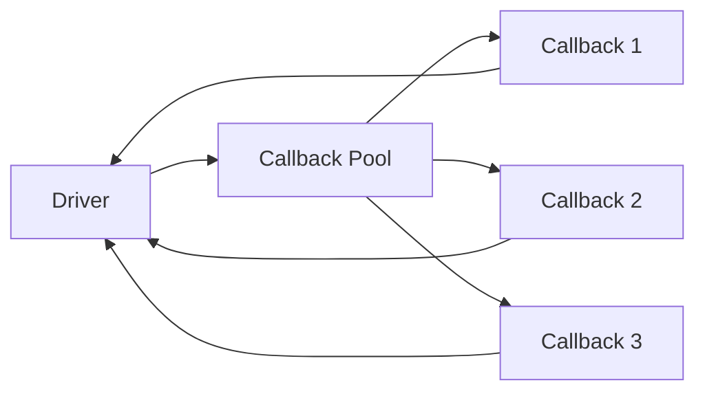
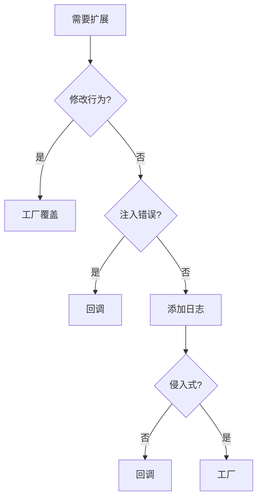

# 🔄 UVM Callbacks 回调机制

## 概述

UVM 回调提供了一种非侵入式的扩展机制，允许在不修改原始代码的情况下添加功能。



## 为什么需要回调？

| 场景 | 工厂覆盖 | 回调 |
|------|----------|------|
| 添加日志 | ✅ | ✅ |
| 修改行为 | ✅ | ❌ |
| 注入错误 | ❌ | ✅ |
| 性能监控 | ❌ | ✅ |

## 目录

1. [回调基础](01-basics/) - 基本概念和使用
2. [高级用法](02-advanced/) - 自定义回调池、动态注册
3. [工厂对比](03-factory-comparison/) - 选择指南
4. [示例代码](examples/) - 完整示例

## 快速示例

```systemverilog
// 定义回调类
class my_callback extends uvm_callback;
    virtual task pre_tx(driver drv, trans tx);
        `uvm_info("CB", "Before TX", UVM_LOW)
    endtask
endclass

// 注册回调
typedef uvm_callbacks#(driver, my_callback) driver_cbs_t;

// 在测试中注册
initial begin
    uvm_callbacks#(driver)::add(null, my_callback::get());
end
```

## 应用场景

- ✅ 错误注入
- ✅ 性能分析
- ✅ 覆盖率收集
- ✅ 协议检查
- ✅ 日志记录

## 与工厂对比



## 在线资源

- [UVM Callback 官方文档](https://verificationacademy.com/)
- [EDA Playground 示例](https://edaplayground.com/)
