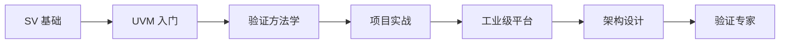

<div align="center">

# 🚀 UVM & SystemVerilog Cookbook

**工业级验证平台学习资源**

[](https://opensource.org/licenses/MIT)
[](https://github.com/jingzhoushii/uvm-sv-cookbook/stargazers)
[](https://github.com/jingzhoushii/uvm-sv-cookbook/network)

</div>

---

## 📚 文档网站

**访问我们的学习网站：**

👉 **[uvm-sv-cookbook.github.io](https://jingzhoushii.github.io/uvm-sv-cookbook/)** 👈

### 特色功能

- 📖 **结构化文档** - 左侧导航 + 右侧内容
- 🔗 **Mermaid 图表** - UVM 架构、时序图可视化
- 🎮 **在线仿真** - EDA Playground 一键运行
- 📊 **学习路径** - Fast Track / Engineer / Architect

---

## 🎯 学习路径

| 路径 | 周期 | 目标 | 适合人群 |
|------|------|------|----------|
| ⚡ [Fast Track](docs/projects/fast-track.md) | 2 周 | 快速入门 | 紧急项目 |
| 🛠️ [Engineer](docs/projects/engineer.md) | 4 周 | 工程能力 | 转岗/面试 |
| 🏗️ [Architect](docs/projects/architect.md) | 6 周 | 架构设计 | 资深工程师 |

---

## 📦 项目内容

### Mini SoC 验证平台

完整的工业级 SoC 验证项目：

```
projects/mini_soc/
├── rtl/           # RTL 设计
├── tb/            # 验证平台
│   ├── agent/     # Agents (Bus/UART/DMA)
│   ├── env/       # Environment
│   ├── virt_seq/  # Virtual Sequences
│   └── test/      # Tests (9+)
├── coverage/       # 覆盖率模型
├── reg/           # 参考模型
└── regress/       # 回归框架
```

### 代码统计

| 类型 | 数量 |
|------|------|
| SV 文件 | 50+ |
| 测试用例 | 9+ |
| 文档章节 | 30+ |
| 代码行数 | 10,000+ |

---

## 🚀 快速开始

### 1. 本地运行

```bash
# 克隆项目
git clone https://github.com/jingzhoushii/uvm-sv-cookbook.git
cd uvm-sv-cookbook

# 运行 Mini SoC
cd projects/mini_soc
make
python3 regress/run_industrial.py --mode nightly
```

### 2. 在线运行

[](https://edaplayground.com/)

### 3. 学习网站

访问 **[文档网站](https://jingzhoushii.github.io/uvm-sv-cookbook/)** 获取完整学习体验。

---

## 📖 文档结构

```
docs/
├── index.md              # 主页
├── quick-start.md        # 快速开始
├── 01-sv-fundamentals/  # SystemVerilog 基础
├── 02-uvm-phases/       # UVM 阶段
├── 03-sequences/        # 序列设计
├── 04-configuration/    # 配置机制
├── 05-tlm-communication/# TLM 通信
├── 06-register-verification/# 寄存器验证
├── 07-testbench-architecture/# 测试平台架构
├── 08-coverage/         # 覆盖率
├── 09-performance/     # 性能优化
├── 10-projects/         # 项目实战
│   ├── mini_soc/       # Mini SoC 详细文档
│   └── learning-paths.md # 学习路径
└── assets/             # 资源文件
```

---

## 🎓 学习路线图



---

## 📊 GitHub 统计


---

## 🤝 贡献

欢迎贡献！请阅读 [CONTRIBUTING.md](CONTRIBUTING.md) 了解详情。

---

## 📝 许可证

本项目采用 MIT 许可证 - 详见 [LICENSE](LICENSE) 文件。

---

<div align="center">

**Made with ❤️ for Verification Engineers**

</div>
