# 📝 SystemVerilog 代码风格指南

## 概述

本项目遵循 SystemVerilog 编码规范，确保代码一致性、可读性和可维护性。

```mermaid
graph LR
    A[代码] --> B[静态检查]
    B --> C[格式化]
    C --> D[CI通过]
    D --> E[代码合并]
```



## 命名规则

### 文件命名

| 类型 | 规则 | 示例 |
|------|------|------|
| 模块 | snake_case | `axi_agent.sv` |
| 类 | CamelCase | `BusDriver` |
| 变量 | snake_case | `bus_addr` |
| 常量 | UPPER_SNAKE_CASE | `MAX_TRANSACTIONS` |
| 参数 | snake_case | `data_width` |

### 示例

```systemverilog
// ✅ 正确
module axi_controller;
    int max_transactions = 100;
    bit [31:0] bus_address;
    
    localparam int DATA_WIDTH = 32;
endmodule

// ❌ 错误
module AXIController;           // 大写模块名
    int MaxTransactions = 100;  // 大驼峰变量
    bit [31:0] BusAddress;      // 大驼峰变量
endmodule
```

### 类命名

```systemverilog
// ✅ 正确
class uvm_driver#(type T=uvm_sequence_item);
class axi_agent;
class bus_scoreboard;

// ❌ 错误
class uvm_driver;               // 无参数
class axiAgent;                // 混合大小写
class bus_scoreboard_t;        // 后缀_t
```

## 缩进与空格

### 缩进

```systemverilog
// ✅ 正确: 4 空格
class my_class extends uvm_component;
    function void build_phase(uvm_phase phase);
        super.build_phase(phase);
        
        if (condition) begin
            do_something();
        end
    endfunction
endclass

// ❌ 错误: Tab 或 2 空格
class my_class extends uvm_component;
  function void build_phase(uvm_phase phase);
    super.build_phase(phase);
  endfunction
endclass
```

### 空格

```systemverilog
// ✅ 正确
if (a == b) begin
    result = x + y;
end

for (int i = 0; i < 10; i++) begin
end

// ❌ 错误
if(a==b)begin
end
for(int i=0;i<10;i++)begin
end
```

## UVM 编码规范

### 宏使用

```systemverilog
// ✅ 正确
`uvm_component_utils(my_driver)
`uvm_object_utils(my_sequence)
`uvm_info("ID", "Message", UVM_LOW)
`uvm_error("ID", "Message")

// ❌ 错误
`uvm_component_utils(my_driver )     // 空格
`uvm_info("ID","Message",UVM_LOW)    // 逗号无空格
```

### 组件注册

```systemverilog
// ✅ 正确
class bus_driver extends uvm_driver#(bus_trans);
    `uvm_component_utils(bus_driver)
    
    function new(string name, uvm_component parent);
        super.new(name, parent);
    endfunction
endclass

// ❌ 错误
class bus_driver extends uvm_driver;
    `uvm_component_utils(bus_driver)  // 缺少类型参数
endclass
```

### 序列定义

```systemverilog
// ✅ 正确
class bus_sequence extends uvm_sequence#(bus_trans);
    `uvm_object_utils(bus_sequence)
    
    rand int count = 10;
    
    virtual task body();
        repeat(count) begin
            bus_trans req;
            `uvm_create(req)
            req.randomize();
            `uvm_send(req)
        end
    endtask
endclass

// ❌ 错误
class bus_sequence extends uvm_sequence;
    `uvm_object_utils(bus_sequence)  // 缺少类型参数
endclass
```

## 端口与连接

### 接口声明

```systemverilog
// ✅ 正确
interface axi4_lite_if #(
    parameter int ADDR_WIDTH = 32,
    parameter int DATA_WIDTH = 32
);
    logic [ADDR_WIDTH-1:0] awaddr;
    logic [DATA_WIDTH-1:0] wdata;
    logic awvalid;
    logic awready;
    
    modport master (
        input awaddr, wdata, awvalid,
        output awready
    );
    
    modport slave (
        input awready,
        output awaddr, wdata, awvalid
    );
endinterface

// ❌ 错误
interface axi_if;
    logic awaddr;  // 缺少位宽
endinterface
```

### 模块实例化

```systemverilog
// ✅ 正确: 命名参数
axi_agent #(
    .ADDR_WIDTH (32),
    .DATA_WIDTH (64)
) agent (
    .clk (clk),
    .rstn (rstn),
    .vif (axi_vif)
);

// ❌ 错误: 位置参数
axi_agent agent (clk, rstn, axi_vif);
```

## 注释规范

### 头部注释

```systemverilog
// ============================================================================
// Module: axi_driver.sv
// Description: AXI4-Lite driver implementation
// Author: Verification Team
// Created: 2024-01-15
// ============================================================================

// ✅ 正确: 文件头部注释
```

### 行内注释

```systemverilog
// ✅ 正确
forever begin
    seq_item_port.get_next_item(req);  // 等待序列项
    drive(req);                         // 驱动事务
    seq_item_port.item_done();          // 完成
end

// ❌ 错误
forever begin
    seq_item_port.get_next_item(req);  // get
    drive(req);  // drive
end
```

## 低功耗编码规范

```systemverilog
// ✅ 正确: UPF 兼容
`ifndef DISABLE_LOW_POWER
    if (power_domain == OFF) begin
        `uvm_info("PWR", "Power domain OFF", UVM_LOW)
        wait (power_domain == ON);
    end
`endif

// ❌ 错误
if (power_domain == 0) begin  // 魔法数字
    // ...
end
```

## 时钟域跨越

```systemverilog
// ✅ 正确: 同步跨时钟域
always @(posedge clk_a or posedge clk_b) begin
    if (rst_a) begin
        sync_reg <= 0;
    end else if (clk_a) begin
        sync_reg <= data_in;
    end
end

// ❌ 错误: 异步跨越
always @(posedge clk_a) begin
    sync_reg <= data_b;  // 跨时钟域
end
```

## 可综合性提示

### 避免的结构

```systemverilog
// ❌ 避免: 延迟语句
#10;  // 仅用于测试平台

// ❌ 避免: 初始块（综合后无效）
initial begin
    state = IDLE;
end

// ✅ 正确: 复位驱动
always @(posedge clk or negedge rst_n) begin
    if (!rst_n) begin
        state <= IDLE;
    end else begin
        state <= next_state;
    end
end
```

## 代码格式化配置

### Verible 配置

```json
{
  "case_sensitive": true,
  "indentation_spaces": 4,
  "wrap_spaces": 4,
  "column_limit": 120
}
```

### 本项目规则

| 规则 | 值 |
|------|-----|
| 缩进 | 4 空格 |
| 行宽 | 120 字符 |
| 大括号 | 同行 (K&R 风格) |
| 命名 | snake_case |

## 检查工具

### 使用 Verible

```bash
# 安装
pip install verible

# 检查文件
verible-format --check axi_driver.sv

# 格式化文件
verible-format axi_driver.sv
```

### CI 检查

```yaml
# .github/workflows/style-check.yml
name: Code Style Check
on: [push, pull_request]

jobs:
  style-check:
    runs-on: ubuntu-latest
    steps:
      - uses: actions/checkout@v4
      - name: Install Verible
        run: pip install verible
      - name: Check formatting
        run: |
          find . -name "*.sv" -exec verible-format --check {} \;
```

## 自动化修复

```bash
# 格式化所有 SV 文件
find . -name "*.sv" -exec verible-format -i {} \;

# 检查并报告
find . -name "*.sv" -exec verible-format --check {} \; || echo "Formatting issues found"
```

## 相关资源

- [Verible](https://github.com/chipsalliance/verible)
- [SV-Lint](https://github.com/dalance/sv-lint)
- [SystemVerilog LRM](https://ieee.org/)
- [Google SV Style Guide](https://google.github.io/styleguide/)

## 检查清单

提交前检查：

- [ ] 命名符合规范
- [ ] 缩进正确（4 空格）
- [ ] 空格正确
- [ ] UVM 宏使用正确
- [ ] 注释完整
- [ ] 通过 Verible 检查
- [ ] 通过 CI 检查

## 违反规则处理

| 严重级别 | 规则 | 处理 |
|----------|------|------|
| 高 | 命名规范 | CI 失败 |
| 高 | 缩进 | CI 失败 |
| 中 | 注释 | 警告 |
| 低 | 行宽 | 警告 |
