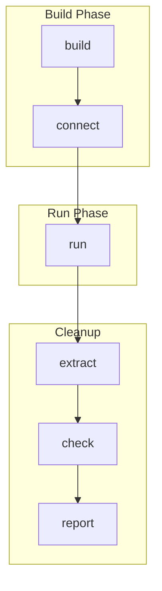
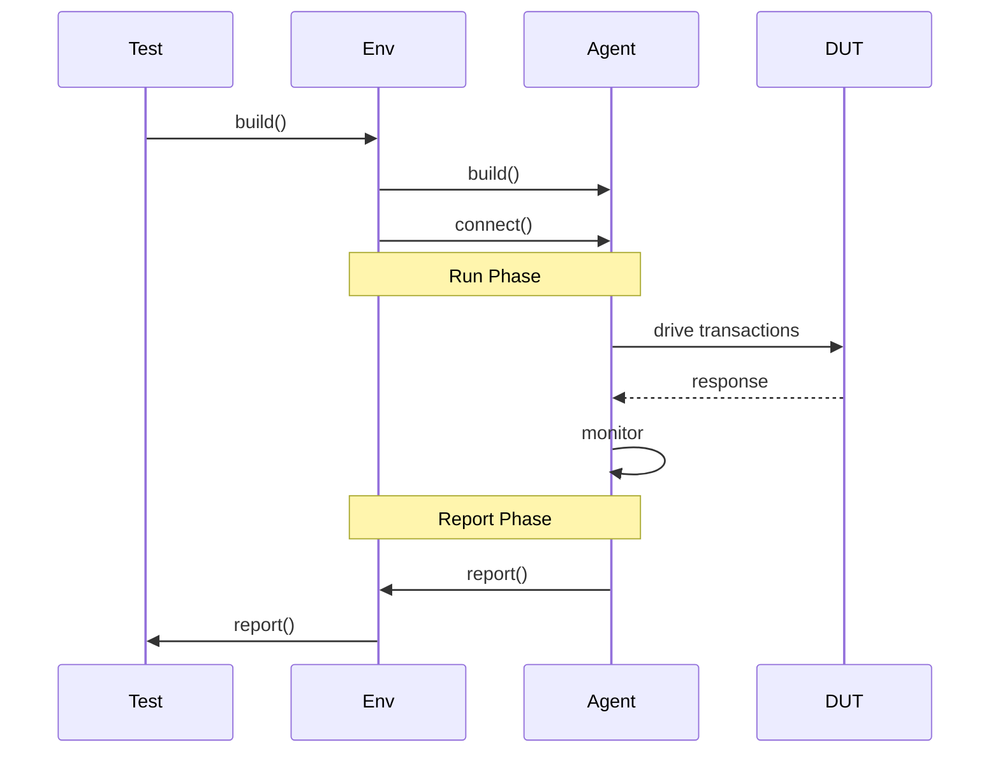

# 📊 UVM 阶段详解

## 阶段概览



## 阶段详解

### 1. Build Phase

| 子阶段 | 目的 | 操作 |
|--------|------|------|
| build | 创建组件 | `uvm_component::create()` |
| connect | 连接组件 | `uvm_port::connect()` |

```systemverilog
virtual function void build_phase(uvm_phase phase);
    super.build_phase(phase);
    
    // 创建组件
    sequencer = uvm_sequencer#(trans)::type_id::create("sequencer", this);
    driver    = uvm_driver#(trans)::type_id::create("driver", this);
    monitor   = uvm_monitor::type_id::create("monitor", this);
endfunction

virtual function void connect_phase(uvm_phase phase);
    super.connect_phase(phase);
    
    // 连接组件
    driver.seq_item_port.connect(sequencer.seq_item_export);
    monitor.ap.connect(scoreboard.analysis_export);
endfunction
```

### 2. Run Phase

| 子阶段 | 目的 | 操作 |
|--------|------|------|
| run | 执行测试 | `task run_phase()` |

```systemverilog
virtual task run_phase(uvm_phase phase);
    phase.raise_objection(this);
    
    forever begin
        trans req;
        seq.start(sequencer);
    end
    
    phase.drop_objection(this);
endtask
```

## 时序图



## 示例项目

查看实际代码：

- [tb/env/mini_soc_env.sv](../../projects/mini_soc/tb/env/mini_soc_env.sv)
- [tb/test/base_test.sv](../../projects/mini_soc/tb/test/base_test.sv)

## 在线运行

运行 UVM 阶段示例：

[:fontawesome-solid-play: EDA Playground](https://edaplayground.com/){ .md-button .md-button--primary }

## 进阶阅读

- [组件层级](02-component-hierarchy.md)
- [配置机制](../04-configuration/01-uvm-config-db.md)
