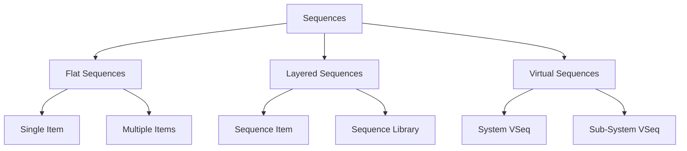
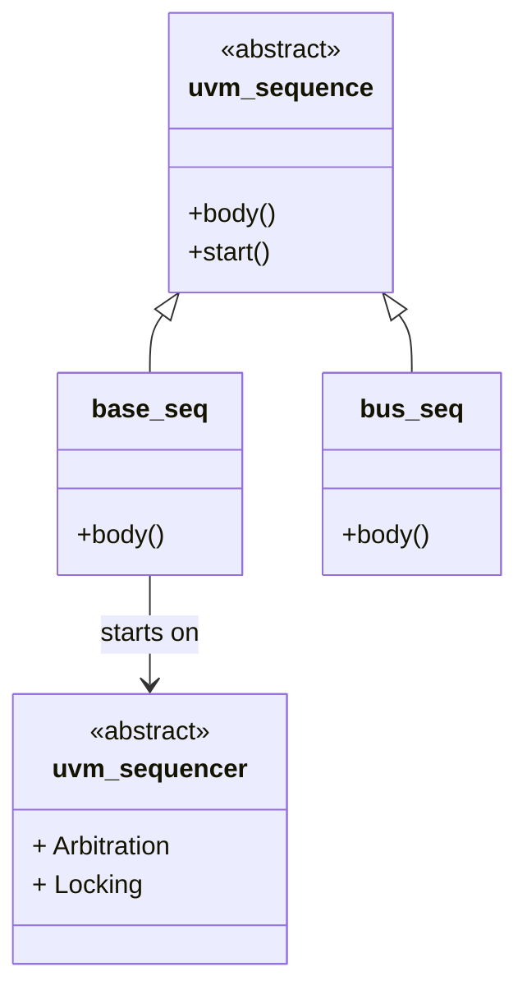
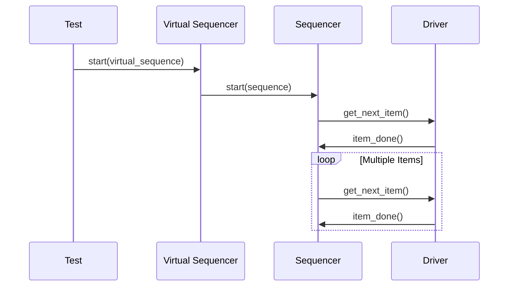

# 🎬 UVM 序列基础

## 序列分类



## 序列层级



## 代码示例

### 1. 基础序列

```systemverilog
class simple_seq extends uvm_sequence#(bus_trans);
    `uvm_object_utils(simple_seq)
    
    int count = 10;
    
    virtual task body();
        for (int i = 0; i < count; i++) begin
            bus_trans req;
            `uvm_do(req)
        end
    endtask
endclass
```

### 2. 约束序列

```systemverilog
class constrained_seq extends uvm_sequence#(bus_trans);
    `uvm_object_utils(constrained_seq)
    
    rand int count;
    rand bit [31:0] start_addr;
    rand bit [31:0] end_addr;
    
    constraint addr_range {
        start_addr inside {[0:'h1000]};
        end_addr inside {[start_addr:start_addr+'h1000]};
    }
    
    virtual task body();
        repeat(count) begin
            bus_trans req;
            `uvm_do_with(req, {
                addr inside {[start_addr:end_addr]};
            })
        end
    endtask
endclass
```

### 3. Virtual Sequence

```systemverilog
class system_vseq extends uvm_virtual_sequence;
    `uvm_object_utils(system_vseq)
    
    // 子序列
    bus_seq      bus_seq;
    uart_seq   uart_seq;
    dma_seq    dma_seq;
    
    virtual task body();
        // 并发执行
        fork
            bus_seq.start(p_sequencer.bus_sqr);
            uart_seq.start(p_sequencer.uart_sqr);
        join_none
        
        #1000;
    endtask
endclass
```

## 启动序列



## 在线运行

运行序列示例：

[:fontawesome-solid-play: EDA Playground](https://edaplayground.com/){ .md-button .md-button--primary }

## 实际项目

- [virt_seq/base_vseq.sv](../../projects/mini_soc/tb/virt_seq/base_vseq.sv)
- [virt_seq/boot_vseq.sv](../../projects/mini_soc/tb/virt_seq/boot_vseq.sv)
- [virt_seq/stress_vseq.sv](../../projects/mini_soc/tb/virt_seq/stress_vseq.sv)
