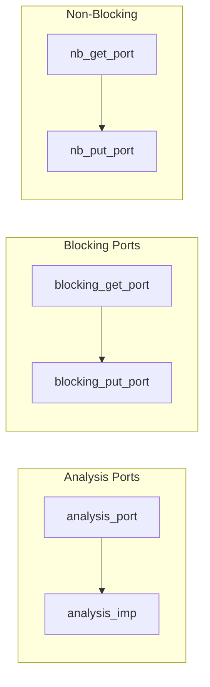
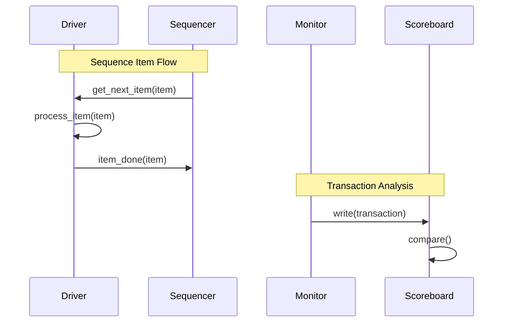
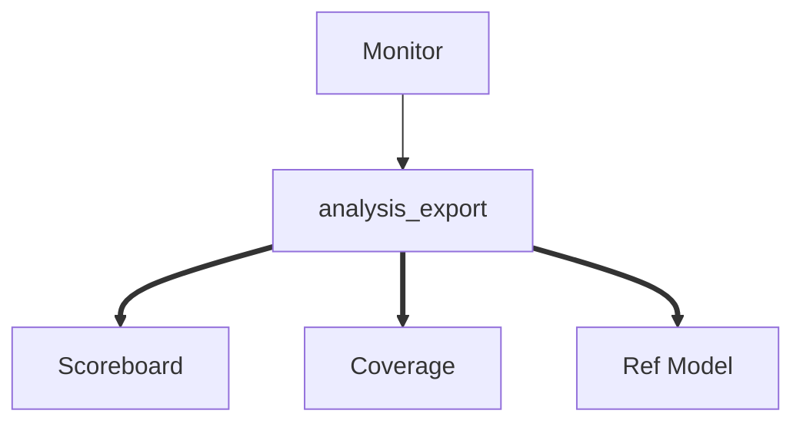

# 🔗 TLM 通信基础

## TLM 端口类型



## 时序图：事务传递



## 代码示例

```systemverilog
// Monitor 发送事务
class bus_monitor extends uvm_monitor;
    uvm_analysis_port#(bus_trans) ap;
    
    virtual function void write(bus_trans t);
        `uvm_info("MON", $sformatf("Saw transaction: %s", t.convert2str()), UVM_LOW)
        ap.write(t);
    endfunction
endclass

// Scoreboard 接收事务
class soc_scoreboard extends uvm_scoreboard;
    uvm_analysis_imp#(bus_trans, soc_scoreboard) bus_in;
    
    virtual function void write(bus_trans t);
        expected_q.push_back(t);
        compare();
    endfunction
endclass
```

## 连接关系



## 在线仿真

运行 TLM 通信示例：

[:fontawesome-solid-play: EDA Playground](https://edaplayground.com/){ .md-button }

## 进阶阅读

- [Analysis Ports 详解](02-analysis-ports.md)
- [TLM FIFO](03-tlm-fifo.md)
