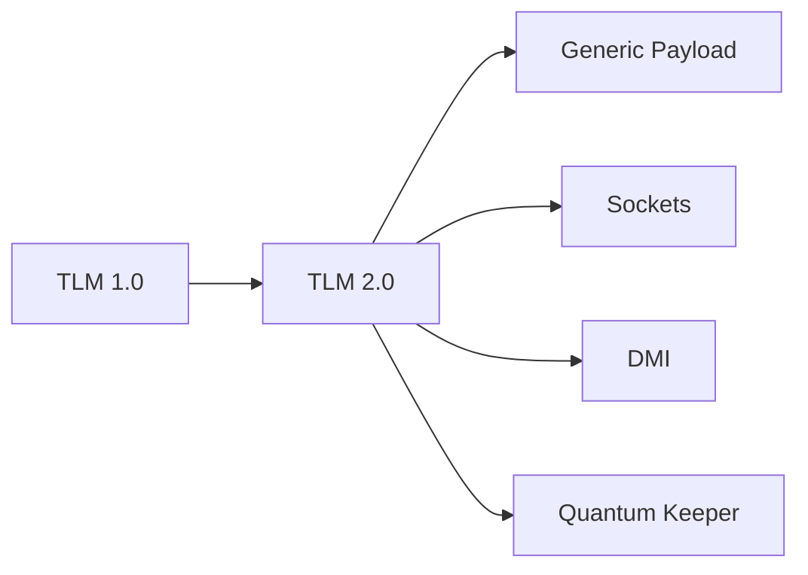

---
hide:
  - navigation
---

# 🚀 TLM 2.0 标准

## 概述

TLM 2.0 是.transaction-level modeling 的行业标准。

## 📚 完整章节

| 章节 | 内容 | 状态 |
|------|------|------|
| [01-简介](01-introduction/) | 标准概述和优势 | ✅ |
| [02-Generic Payload](02-generic-payload/) | 标准事务类型 | ✅ |
| [03-Sockets & Interfaces](03-sockets-interfaces/) | 端口和接口 | ✅ |
| [04-DMI](04-dmi/) | 直接内存访问 | ✅ |
| [05-Quantum Keeper](05-quantum-keeper/) | 时间同步 | ✅ |
| [06-SystemC 协同](06-systemc-cosim/) | 跨语言仿真 | ✅ |
| [示例代码](examples/) | 完整示例 | ✅ |

## TLM 1.0 vs 2.0

| 特性 | TLM 1.0 | TLM 2.0 |
|------|----------|----------|
| 事务类型 | 自定义 | Generic Payload |
| 传输接口 | put/get/transport | blocking/non-blocking |
| 内存接口 | 无 | DMI |
| 时间管理 | 无 | Quantum Keeper |
| SystemC 兼容 | 有限 | 完全 |

## 核心组件

- **Generic Payload**: 标准事务类型
- **Sockets**: 端口连接机制
- **Transport Interfaces**: 传输接口
- **DMI**: 直接内存访问
- **Quantum Keeper**: 时间管理

## 📁 示例代码

- [tlm2_basic.sv](examples/basic/tlm2_basic.sv)
- [tlm2_dmi.sv](examples/dmi/tlm2_dmi.sv)

## 在线资源

- [TLM 2.0 标准](https://www.accellera.org/)
- [EDA Playground](https://edaplayground.com/)

## 相关章节

- [TLM 基础](../01-tlm-basics/)
- [Analysis Ports](../02-analysis-ports/)
