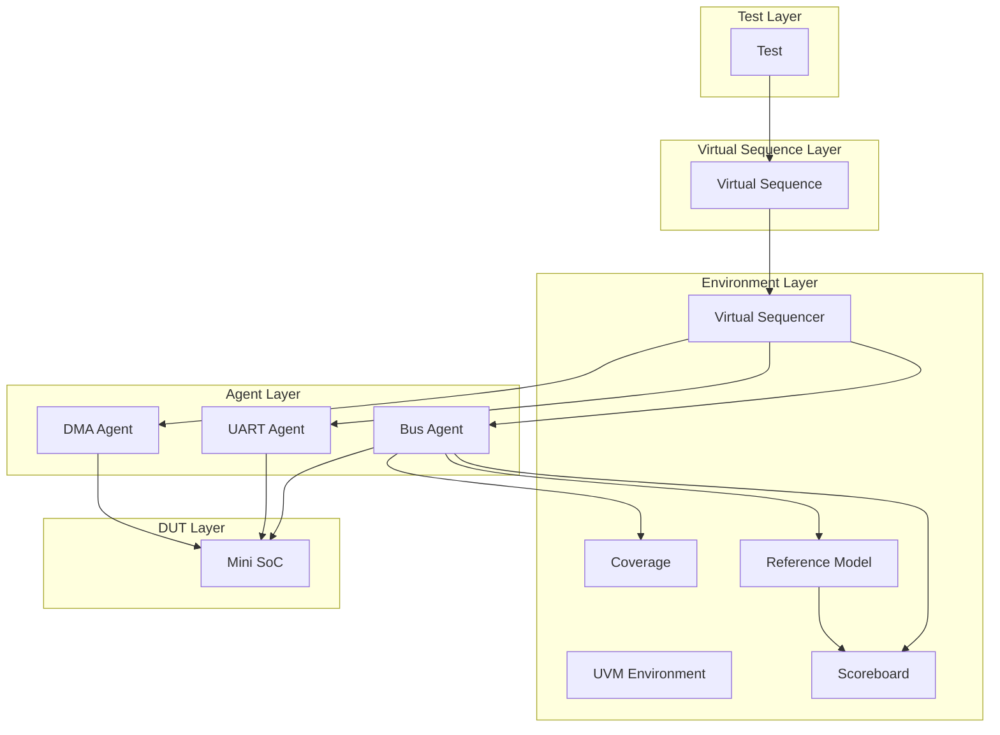
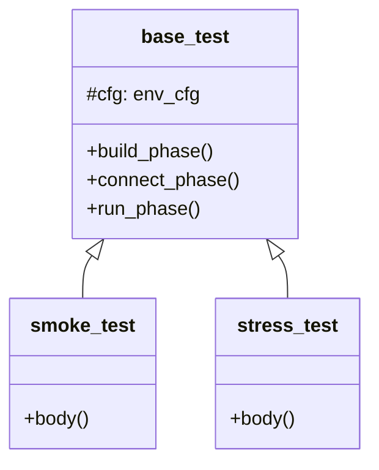
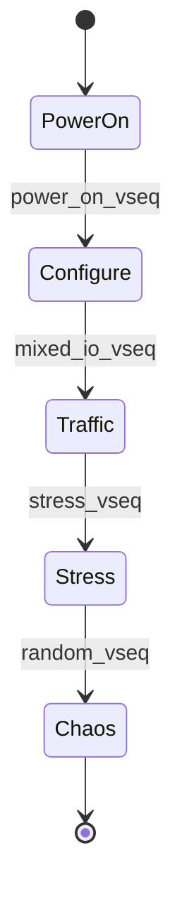
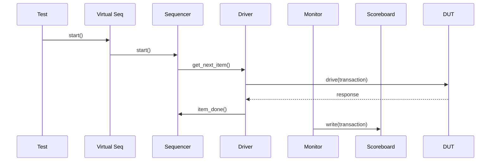

# 🏗️ UVM 测试平台架构

## 整体架构



## 组件详解

### 1. Test Layer



### 2. Virtual Sequence Layer



### 3. Communication Flow



## 目录结构

```
projects/mini_soc/tb/
├── agent/
│   ├── bus_agent/
│   │   ├── bus_driver.sv
│   │   ├── bus_monitor.sv
│   │   └── bus_sequencer.sv
│   ├── uart_agent/
│   └── dma_agent/
├── env/
│   ├── mini_soc_env.sv
│   └── mini_soc_env_cfg.sv
├── virt_seq/
│   ├── base_vseq.sv
│   ├── boot_vseq.sv
│   └── stress_vseq.sv
└── test/
    ├── base_test.sv
    ├── smoke_test.sv
    └── stress_test.sv
```

## 在线仿真

点击下方运行 UVM 架构示例：

[:fontawesome-solid-play: Run on EDA Playground](https://edaplayground.com/){ .md-button .md-button--primary }

## 相关章节

- [UVM 阶段](02-uvm-phases/01-phases.md)
- [TLM 通信](05-tlm-communication/01-tlm-basics.md)
- [序列设计](03-sequences/01-sequences.md)
