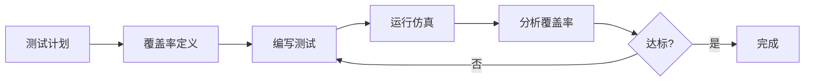
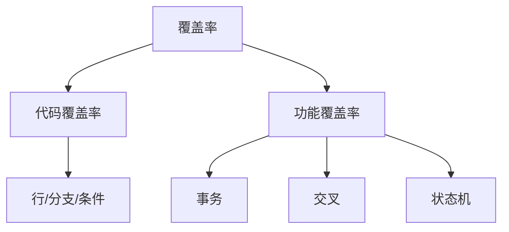

---
hide:
  - navigation
---

# 📊 覆盖率驱动验证 (CDV)

## 概述

覆盖率驱动验证（Coverage-Driven Verification, CDV）是以覆盖率为导向的验证方法学。

## 📚 完整章节

| 章节 | 内容 | 状态 |
|------|------|------|
| [01-基础](01-fundamentals/) | 覆盖率类型、基本收集 | ✅ |
| [02-交叉覆盖率](02-cross-coverage/) | 交叉覆盖、过渡覆盖 | ✅ |
| [03-寄存器覆盖率](03-reg-coverage/) | 与RAL联动分析 | ✅ |
| [04-自动报告](04-auto-report/) | uvm_subscriber 自动报告 | ✅ |
| [示例代码](../08-coverage-driven-verification/examples/) | 完整可运行示例 | ✅ |

## 🎯 核心内容

- ✅ 事务覆盖率
- ✅ 交叉覆盖率 (ADDR×RW×SIZE)
- ✅ 过渡覆盖率
- ✅ 寄存器覆盖率
- ✅ 自动报告机制
- ✅ HTML 报告生成

## 覆盖类型

## 覆盖率目标

| 类型 | 目标 | Mini SoC |
|------|------|----------|
| 事务覆盖 | 80% | ✅ |
| 交叉覆盖 | 75% | ✅ |
| 寄存器覆盖 | 80% | ✅ |
| 总体覆盖 | 75% | ✅ |

## 📁 示例代码

- [basic_coverage.sv](../08-coverage-driven-verification/examples/basic/basic_coverage.sv)
- [cross_coverage.sv](../08-coverage-driven-verification/examples/cross_coverage.sv)
- [reg_coverage.sv](../08-coverage-driven-verification/examples/reg_coverage.sv)

## 在线运行

[:fontawesome-solid-play: EDA Playground](https://edaplayground.com/){ .md-button }

## 相关章节

- [UVM 组件](02-uvm-phases/)
- [TLM 通信](05-tlm-communication/)
- [寄存器模型](09-register-model-ral/)
