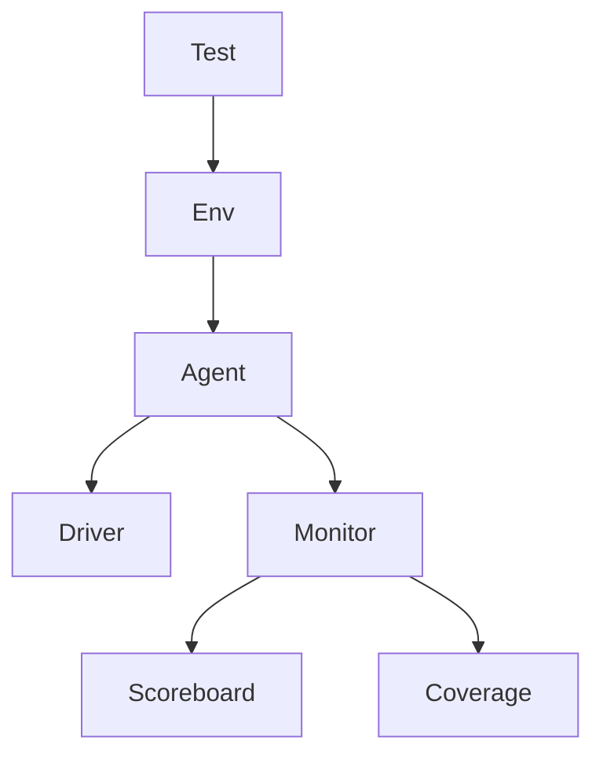
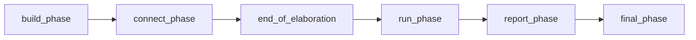
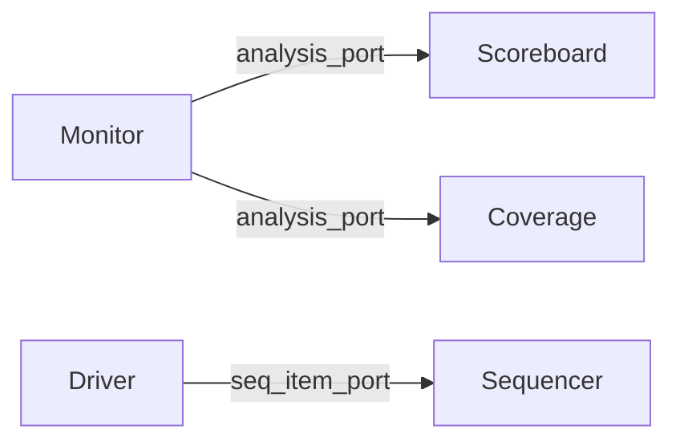
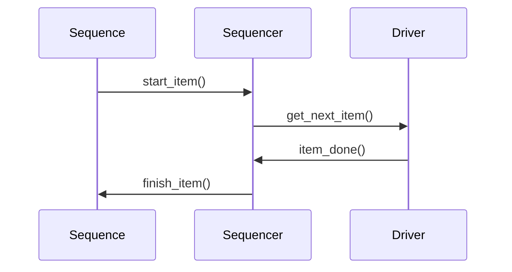

# Mermaid 图表

## UVM 组件关系

```mermaid
graph TD
    A[Test] --> B[Env]
    B --> C[Agent]
    C --> D[Driver]
    C --> E[Monitor]
    E --> F[Scoreboard]
    E --> G[Coverage]
```

## UVM Phase 流程

```mermaid
graph LR
    A[build_phase] --> B[connect_phase]
    B --> C[end_of_elaboration]
    C --> D[run_phase]
    D --> E[report_phase]
    E --> F[final_phase]
```

## TLM 连接

```mermaid
graph LR
    A[Monitor] -->|analysis_port| B[Scoreboard]
    A -->|analysis_port| C[Coverage]
    D[Driver] -->|seq_item_port| E[Sequencer]
```

## Sequence 生命周期

```mermaid
sequenceDiagram
    participant Seq as Sequence
    participant Seqr as Sequencer
    participant Drv as Driver
    
    Seq->>Seqr: start_item()
    Seqr->>Drv: get_next_item()
    Drv->>Seqr: item_done()
    Seqr->>Seq: finish_item()
```

