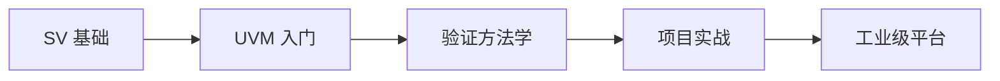

---
hide:
  - navigation
---

# 🚀 UVM & SystemVerilog Cookbook

<div align="center">

{ width=80% }

**工业级验证平台学习资源**

[快速开始](quick-start.md){ .md-button .md-button--primary }
[GitHub](https://github.com/jingzhoushii/uvm-sv-cookbook){ .md-button }
[在线仿真](https://eda-playground){ .md-button }

</div>

---

## 📚 课程体系



### 🎯 学习路径

| 路径 | 周期 | 目标 | 适合人群 |
|------|------|------|----------|
| ⚡ Fast Track | 2 周 | 快速入门 | 紧急项目 |
| 🛠️ Engineer | 4 周 | 工程能力 | 转岗/面试 |
| 🏗️ Architect | 6 周 | 架构设计 | 资深工程师 |

---

## ✨ 核心特性

- ✅ **工业级验证平台** - Mini SoC 完整实现
- ✅ **完整源码** - 50+ SystemVerilog 文件
- ✅ **分层架构** - Agent → Environment → Testbench
- ✅ **可交互示例** - 在线运行 + 修改
- ✅ **可视化图表** - Mermaid UML 图解

---

## 📦 项目结构

```
uvm-sv-cookbook/
├── 01-sv-fundamentals/      # SystemVerilog 基础
├── 02-uvm-phases/           # UVM 阶段
├── 03-sequences/            # 序列设计
├── 04-configuration/        # 配置机制
├── 05-tlm-communication/    # TLM 通信
├── 06-register-verification/# 寄存器验证
├── 07-testbench-architecture/# 测试平台架构
├── 08-coverage/             # 覆盖率
├── 09-performance/         # 性能优化
├── 10-projects/            # 项目实战
│   └── mini_soc/           # Mini SoC 平台
├── projects/mini_soc/      # Mini SoC 源码
├── docs/                   # 文档
└── assets/                 # 资源文件
```

---

## 🚀 快速开始

```bash
# 克隆项目
git clone https://github.com/jingzhoushii/uvm-sv-cookbook.git
cd uvm-sv-cookbook

# 运行示例
cd projects/mini_soc
make
python3 regress/run_industrial.py --mode nightly
```

---

## 📊 项目统计

- **SV 文件**: 50+
- **测试用例**: 9+
- **学习章节**: 30+
- **代码行数**: 10,000+

---

<div align="center">

**Made with ❤️ for Verification Engineers**

</div>
