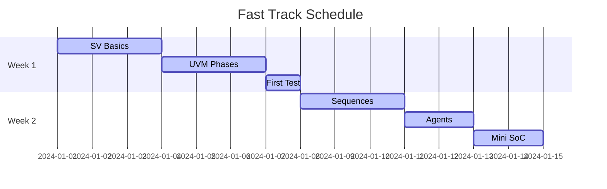
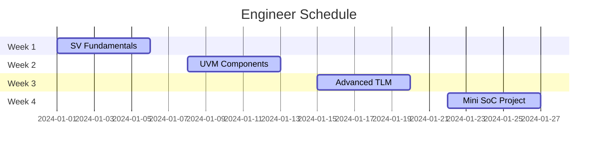
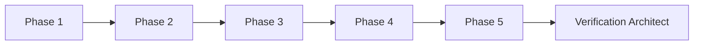
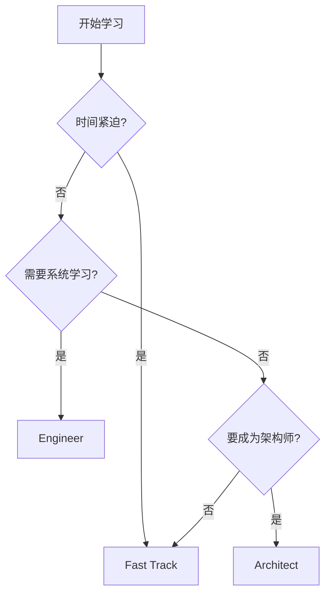

# 🛤️ 学习路径选择

## 路径对比

| 路径 | 周期 | 内容 | 难度 |
|------|------|------|------|
| ⚡ Fast Track | 2 周 | 核心概念 | ⭐⭐ |
| 🛠️ Engineer | 4 周 | 完整体系 | ⭐⭐⭐ |
| 🏗️ Architect | 6 周 | 工业实战 | ⭐⭐⭐⭐ |

---

## ⚡ Fast Track (2 周)

### 目标
快速掌握 UVM 验证核心概念，能够读懂和修改现有测试平台。

### 周计划

### 必读章节

1. [UVM 阶段](../02-uvm-phases/01-phases.md)
2. [第一个测试](../quick-start.md)
3. [序列基础](../03-sequences/01-sequences.md)
4. [Mini SoC 项目](mini_soc/index.md)

### 在线运行

[:fontawesome-solid-play: Start Fast Track](https://edaplayground.com/){ .md-button .md-button--primary }

---

## 🛠️ Engineer (4 周)

### 目标
建立完整的验证知识体系，能够独立搭建测试平台。

### 周计划

### 核心技能

- ✅ SystemVerilog OOP
- ✅ UVM 组件体系
- ✅ 序列和配置机制
- ✅ TLM 通信
- ✅ 覆盖率模型
- ✅ 回归框架

### 实战项目

完成 Mini SoC 所有测试用例。

---

## 🏗️ Architect (6 周)

### 目标
掌握工业级验证平台设计，具备架构师思维。

### 里程碑

### 进阶主题

| 周次 | 主题 | 产出 |
|------|------|------|
| 1-2 | 平台架构设计 | 架构文档 |
| 3-4 | 参考模型开发 | 行为模型 |
| 5-6 | 覆盖率闭合 | 验证报告 |

### 学习成果

- 能够设计可扩展验证平台
- 掌握覆盖率驱动验证方法
- 理解工业级回归流程

---

## 🎯 选择建议

---

## 📚 推荐资源

### 书籍
- 《UVM实战》
- 《SystemVerilog验证》
- 《芯片验证漫游指南》

### 在线
- [EDAPlayground](https://edaplayground.com/)
- [Verification Academy](https://verificationacademy.com/)

### 视频
- YouTube: UVM Tutorials
- Bilibili: 芯片验证

---

## 🚀 开始学习

选择你的路径：

[Fast Track ⚡](fast-track.md){ .md-button }
[Engineer 🛠️](engineer.md){ .md-button }
[Architect 🏗️](architect.md){ .md-button }
