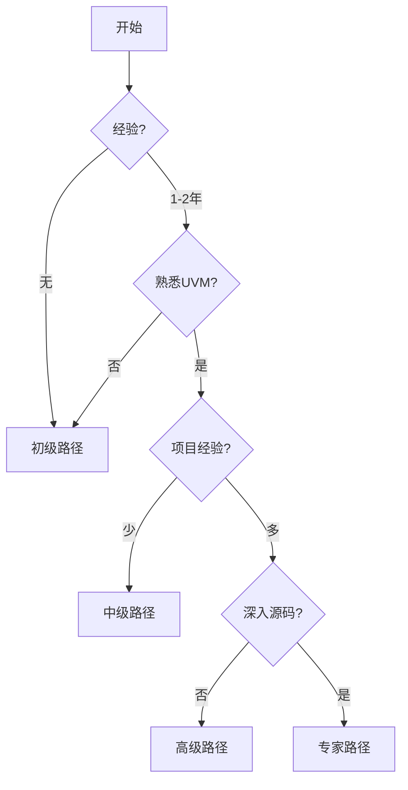

---
hide:
  - navigation
---

# 🛤️ 学习路径选择

## 概述

本项目提供 4 个完整学习路径，从入门到专家级别。


## 路径对比

| 路径 | 周期 | 难度 | 预计时长 | 目标 |
|------|------|------|----------|------|
| ⚡ [初级](primary.md) | 2 周 | ⭐ | 20-30h | 掌握基础 |
| 🛠️ [中级](intermediate.md) | 4 周 | ⭐⭐ | 40-60h | 独立开发 |
| 🏗️ [高级](advanced.md) | 6 周 | ⭐⭐⭐ | 60-90h | 复杂验证 |
| 🎓 [专家](expert.md) | 8 周 | ⭐⭐⭐⭐ | 80-120h | 架构设计 |

## 选择建议



## 初级路径 ⚡

**目标**: SystemVerilog + UVM 基础

```
Week 1: SV 基础
├── 数据类型
├── OOP 类
├── 接口
└── 线程通信

Week 2: UVM 组件
├── UVM 基础
├── 组件层次
├── 序列基础
└── 简单 Agent
```

[开始学习 →](primary.md){ .md-button }

## 中级路径 🛠️

**目标**: 寄存器模型、TLM、覆盖率

```
Week 1: 寄存器模型
├── 寄存器块
├── 适配器
└── 寄存器序列

Week 2: 高级序列
├── Virtual Sequence
├── 配置数据库
└── TLM 基础

Week 3: TLM 高级
├── Analysis Port
├── TLM FIFO
└── TLM 2.0

Week 4: 覆盖率
├── Coverage 基础
├── 交叉覆盖
└── Mini SoC
```

[开始学习 →](intermediate.md){ .md-button }

## 高级路径 🏗️

**目标**: 低功耗、中断、形式验证、性能

```
Week 1-2: 低功耗
├── 电源域
├── 功耗序列
└── 功耗覆盖

Week 3-4: 中断
├── 中断机制
├── 中断序列
└── 中断覆盖

Week 5: 形式验证
├── 基础
├── SVA 断言
└── UVM+形式

Week 6: 性能优化
├── 优化基础
├── 序列优化
└── 覆盖优化
```

[开始学习 →](advanced.md){ .md-button }

## 专家路径 🎓

**目标**: UVM 源码、自定义库、架构

```
Week 1-2: 源码分析
├── 工厂机制
├── 相位机制
└── TLM 实现

Week 3-4: 自定义库
├── 组件基类
├── 序列库
└── 报告系统

Week 5-6: UVM 1800.2
├── 虚拟类
├── 新特性
└── 迁移指南

Week 7-8: 项目重构
├── Mini SoC 重构
├── 架构设计
└── 技术分享
```

[开始学习 →](expert.md){ .md-button }

## 每周时间规划

| 路径 | 每日 | 每周 | 總計 |
|------|------|------|------|
| 初级 | 1-2h | 10-15h | 20-30h |
| 中级 | 1-2h | 10-15h | 40-60h |
| 高级 | 1-2h | 10-15h | 60-90h |
| 专家 | 1-2h | 10-15h | 80-120h |

## 前置要求

| 路径 | 前置要求 |
|------|----------|
| 初级 | 编程基础 + 数字电路 |
| 中级 | 初级路径完成 |
| 高级 | 中级路径完成 |
| 专家 | 高级路径 + 2-3 年经验 |

## 学习建议

### 1. 按顺序学习
每个路径有前置依赖，建议按顺序完成。

### 2. 动手实践
每章都有示例代码，建议边学边练。

### 3. 项目驱动
最后做 Mini SoC 项目，综合应用所学。

### 4. 持续迭代
多次复习，巩固知识。

## 检查清单

完成路径后，检查：

- [ ] 核心知识点掌握
- [ ] 能独立开发
- [ ] 完成实践项目
- [ ] 通过考核测试

## 认证建议

专家路径后，可考虑：

- Accellera UVM 认证
- VCS 认证工程师
- Formal 认证

## 相关资源

- [GitHub](https://github.com/jingzhoushii/uvm-sv-cookbook)
- [EDA Playground](https://edaplayground.com/)
- [Verification Academy](https://verificationacademy.com/)
- [IEEE 1800.2](https://ieeexplore.ieee.org/)

---

<div align="center">

**选择你的路径，开始学习！**

[初级 ⚡](primary.md) | [中级 🛠️](intermediate.md) | [高级 🏗️](advanced.md) | [专家 🎓](expert.md)

</div>
