---
hide:
  - navigation
---

# 📝 代码风格指南

## 概述

本项目遵循 SystemVerilog 编码规范，确保代码一致性。

```mermaid
graph LR
    A[代码] --> B[静态检查]
    B --> C[格式化]
    C --> D[CI通过]
```



## 工具

| 工具 | 用途 | 状态 |
|------|------|------|
| [Verible](https://github.com/chipsalliance/verible) | 代码格式化 | ✅ |
| [SV-Lint](https://github.com/dalance/sv-lint) | 代码检查 | ✅ |

## 快速开始

### 安装工具

```bash
# 安装 Verible
pip install verible

# 安装 SV-Lint
cargo install sv-lint
```

### 检查代码

```bash
# 检查所有文件
./scripts/check_style.sh

# 检查指定文件
./scripts/check_style.sh tb/agent/my_agent.sv
```

### 格式化代码

```bash
# 格式化所有文件
./scripts/format_code.sh

# 格式化指定文件
./scripts/format_code.sh tb/agent/my_agent.sv
```

## CI 检查

GitHub Actions 自动检查：

```yaml
# .github/workflows/style-check.yml
name: Code Style Check
on: [push, pull_request]
```

## 命名规则

| 类型 | 规则 | 示例 |
|------|------|------|
| 文件 | snake_case | `axi_agent.sv` |
| 类 | CamelCase | `BusDriver` |
| 变量 | snake_case | `bus_addr` |
| 常量 | UPPER_CASE | `MAX_SIZE` |

## 检查清单

提交前：

- [ ] 运行 `./scripts/check_style.sh`
- [ ] 修复所有错误
- [ ] 更新注释
- [ ] 通过 CI 检查

## 相关文件

- [STYLE_GUIDE.md](../STYLE_GUIDE.md) - 完整风格指南
- [.verible/verible_sv_style.yaml](../.verible/verible_sv_style.yaml) - Verible 配置
- [.svlint.yaml](../.svlint.yaml) - SV-Lint 配置

## 在线资源

- [Verible 文档](https://chipsalliance.github.io/verible/)
- [SV-Lint 文档](https://github.com/dalance/sv-lint)
- [Google SV Style](https://google.github.io/styleguide/)
